# Bootstrap Core Infrastructure

## Introduction

The **bootstrap_core_infrastructure** module is the foundation layer of the Bootstrap v5.3.3 JavaScript library that ships as a static asset of the **AgentsWebUI** application (`0-Agents/AgentsWebUI/wwwroot/lib/bootstrap/dist/js/`). No component in this module appears on screen as a widget. The module provides:

- the **base classes** that every Bootstrap plugin inherits from (`Config`, `BaseComponent`), and
- the **helpers** that the visible plugins are built from (`Backdrop`, `FocusTrap`, `ScrollBarHelper`, `Swipe`, `TemplateFactory`).

The same code appears in three distribution files. They differ only in how they are packaged and how they load Popper:

| File | Format | Popper.js | Typical use |
|---|---|---|---|
| `bootstrap.bundle.js` | UMD (global `bootstrap`, CommonJS, AMD) | **Inlined** (Popper v2 core is compiled into the file) | Drop-in `<script>` tag with no other dependencies. This is the usual choice in ASP.NET `_Layout.cshtml` pages. |
| `bootstrap.js` | UMD | **External**: `require('@popperjs/core')`, AMD dependency, or the global `window.Popper` | A `<script>` tag when Popper is loaded separately |
| `bootstrap.esm.js` | ES module (`export { Alert, … }`) | **External**: `import * as Popper from '@popperjs/core'` | Bundlers and `<script type="module">` |

The infrastructure classes behave the same way in all three files. Popper is used only by the positioned overlays (Dropdown and Tooltip/Popover). See [bootstrap_overlay_components](bootstrap_overlay_components.md).

### Related modules

| Module | Relationship |
|---|---|
| [bootstrap_overlay_components](bootstrap_overlay_components.md) | Modal, Offcanvas, Dropdown, Tooltip, Popover and Toast. These are the main users of `Backdrop`, `FocusTrap`, `ScrollBarHelper` and `TemplateFactory`. |
| [bootstrap_interactive_content_components](bootstrap_interactive_content_components.md) | Alert, Button, Collapse, Carousel, Tab and ScrollSpy. All of them extend `BaseComponent`, and Carousel uses `Swipe`. |

---

## Architecture Overview

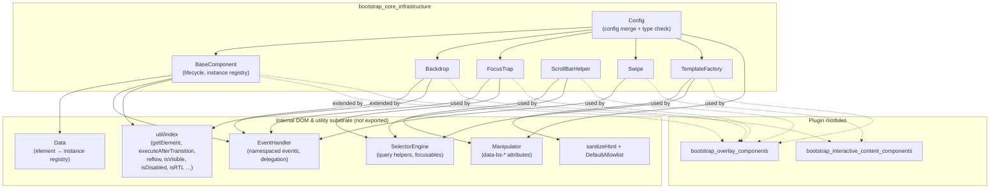

### Class hierarchy

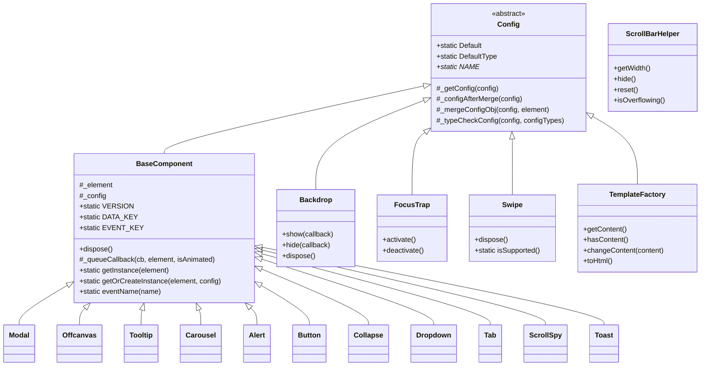

`ScrollBarHelper` is a standalone class. It has no configuration, so it does **not** extend `Config`.

---

## Internal Substrate (context)

These singletons are private to each distribution file and are not exported. The core classes are built on them, so knowing what they do helps explain the rest of this page.

| Unit | Responsibility |
|---|---|
| **Data** | A `Map<Element, Map<key, instance>>`. `set` stores an instance and **refuses a second component type on the same element**: it logs `Bootstrap doesn't allow more than one instance per element` and returns. `remove` releases the element entry once it holds no instances. |
| **EventHandler** | Wraps `addEventListener` and adds namespaces (`click.bs.modal`), delegation (`on(el, evt, selector, fn)`), one-shot handlers (`one`), and the emulated `mouseenter`/`mouseleave` events. `trigger` dispatches a cancelable native `Event`. If jQuery is present and the event is namespaced, it mirrors the event through jQuery. |
| **Manipulator** | Reads and writes `data-bs-*` attributes and normalizes their values: `"true"`/`"false"` become booleans, numeric strings become numbers, `""`/`"null"` become `null`, and JSON strings are parsed. |
| **SelectorEngine** | Query helpers (`find`, `findOne`, `parents`, `prev`, `next`). `focusableChildren` returns the visible, enabled, tabbable descendants of an element. The helpers also resolve targets from `data-bs-target` or `href`. |
| **util** | Includes `getElement` (accepts a selector, element or jQuery object), `executeAfterTransition`, `reflow`, `isVisible`, `isDisabled`, `isRTL`, `getUID`, `execute`, `defineJQueryPlugin` and `onDOMContentLoaded`. |
| **sanitizer** | `sanitizeHtml` and `DefaultAllowlist`. `TemplateFactory` uses them to strip unsafe HTML. |

---

## Core Components

### 1. `Config`: configuration resolution and validation

`Config` is the abstract root class. It gives every configurable class the same pipeline for resolving and checking options.

**Static contract (overridden by subclasses)**

- `Default` sets the default option values (`{}` in the base class).
- `DefaultType` maps each option to a regex-like type string such as `'(boolean|string)'`.
- `NAME` is the component name. The base implementation **throws**, so every subclass must define it.

**Pipeline** (`_getConfig`):

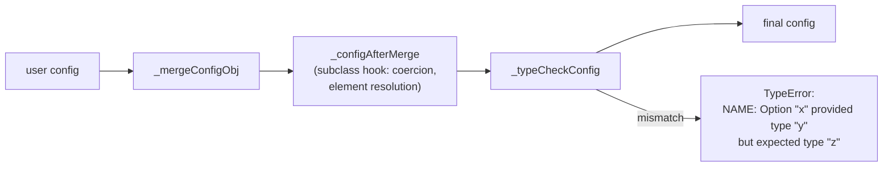

**Merge precedence.** When an element is passed, the order below runs from lowest to highest priority:

1. `this.constructor.Default`
2. the JSON object in `data-bs-config` on the element
3. individual `data-bs-*` attributes (from `Manipulator.getDataAttributes`, which skips `bsConfig*`)
4. the `config` object passed in JavaScript

Helpers that use the base `Config._getConfig` (`Backdrop`, `FocusTrap`, `Swipe`, `TemplateFactory`) pass no element. Only steps 1 and 4 apply to them.

**Type checking.** Each value is classified with `toType()`. The possible results are `'string'`, `'number'`, `'boolean'`, `'function'`, `'object'`, `'array'`, `'null'` and `'undefined'`. DOM nodes and jQuery objects are classified as `'element'`. The classification is tested against `new RegExp(expectedTypes)`.

---

### 2. `BaseComponent`: plugin lifecycle

`BaseComponent extends Config`. Every public plugin inherits from it, including Alert, Button, Carousel, Collapse, Dropdown, Modal, Offcanvas, Popover, ScrollSpy, Tab, Toast and Tooltip.

**Constructor**

1. `getElement(element)` resolves the element. If nothing resolves, the constructor **returns without error** and leaves an inert object with no `_element`.
2. It stores `this._element` and resolves `this._config` using the element-aware `_getConfig`, which includes `data-bs-*` attributes.
3. It calls `Data.set(element, DATA_KEY, this)` to register the instance.

**Static API**

| Member | Value / behaviour |
|---|---|
| `VERSION` | `'5.3.3'` |
| `DATA_KEY` | `` `bs.${NAME}` ``, for example `bs.modal` |
| `EVENT_KEY` | `` `.${DATA_KEY}` ``, for example `.bs.modal` |
| `eventName(name)` | `name + EVENT_KEY`, for example `show.bs.modal` |
| `getInstance(el)` | Looks up the instance in `Data`. Returns `null` if there is none. |
| `getOrCreateInstance(el, config = {})` | Returns the existing instance, or creates one. A non-object `config` is ignored. |

**Instance API**

- `dispose()` removes the `Data` entry and calls `EventHandler.off(element, EVENT_KEY)`, which removes every handler in the component's namespace. It then sets every own property to `null`. Subclasses extend `dispose()` to tear down their own helpers, such as a Backdrop, FocusTrap, Swipe or Popper instance.
- `_queueCallback(callback, element, isAnimated = true)` wraps `executeAfterTransition`. When `isAnimated` is true, it waits for the element's `transitionend`. As a fallback it sets a timer for the computed `transition-duration + transition-delay + 5 ms` and fires a synthetic `transitionend` if the real one never arrives. When `isAnimated` is false, the callback runs synchronously.

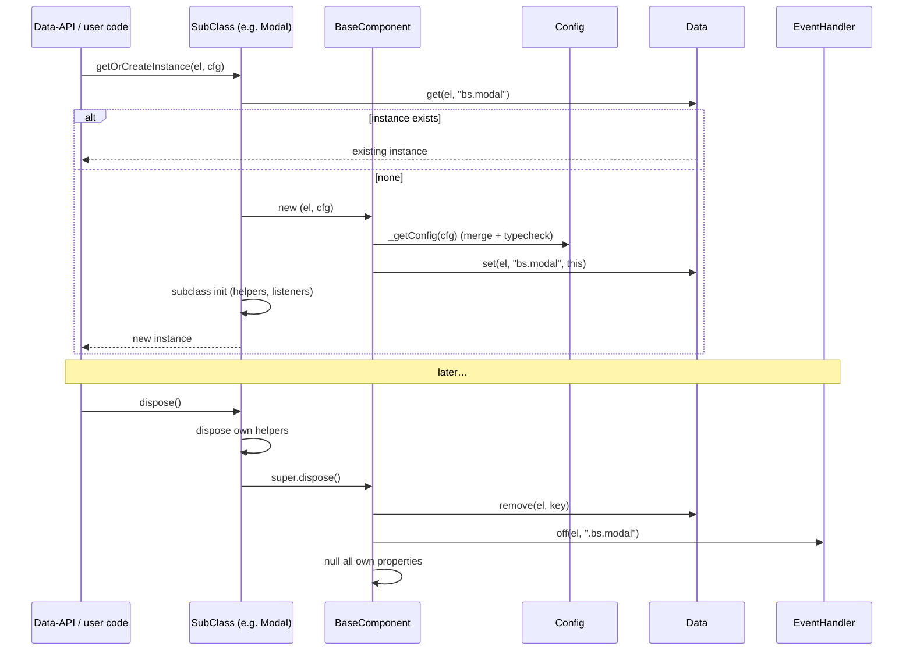

---

### 3. `Backdrop`: overlay shade element

`Backdrop` creates the dimming layer shown behind modal surfaces, adds it to the page, animates it, and removes it again.

**Configuration**

| Option | Default | Type | Notes |
|---|---|---|---|
| `className` | `'modal-backdrop'` | string | Offcanvas passes `'offcanvas-backdrop'` |
| `clickCallback` | `null` | function\|null | Called on `mousedown.bs.backdrop` |
| `isAnimated` | `false` | boolean | Adds the `fade` class and waits for the transition |
| `isVisible` | `true` | boolean | If `false`, no element is created and callbacks run immediately |
| `rootElement` | `'body'` | element\|string | Resolved to an element in `_configAfterMerge` |

**Behaviour**

- The `
` element is created lazily by `_getElement()`. It is appended to `rootElement` once, by `_append()`, which is guarded by `_isAppended`.
- `show(cb)` appends the element, forces a reflow when animated, adds `show`, and runs `cb` after the transition.
- `hide(cb)` removes `show`. After the transition it calls `dispose()`, which unbinds the mousedown handler and removes the element, and then runs `cb`.

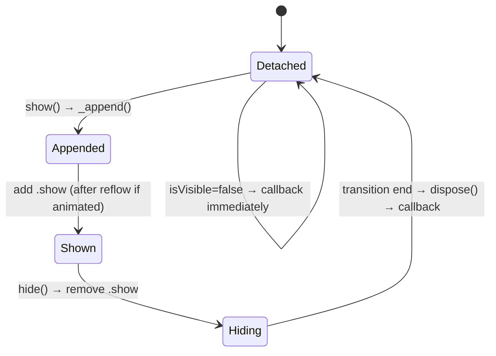

Consumers: **Modal** (the backdrop is in `body`; the `static` option is coerced to `isVisible: true`) and **Offcanvas** (the backdrop is in the offcanvas element's parent node and is always animated). See [bootstrap_overlay_components](bootstrap_overlay_components.md).

---

### 4. `FocusTrap`: accessible focus containment

`FocusTrap` keeps keyboard focus inside a dialog-like element while that element is active.

**Configuration**

| Option | Default | Type |
|---|---|---|
| `autofocus` | `true` | boolean |
| `trapElement` | `null` | element (required: the type check fails if it is not an element) |

**Mechanics**

- `activate()` focuses `trapElement` if `autofocus` is set. It then removes any earlier `.bs.focustrap` listeners on `document`, which prevents focus ping-pong when one trap replaces another. Finally it binds:
  - `focusin.bs.focustrap`, handled by `_handleFocusin`
  - `keydown.tab.bs.focustrap`, handled by `_handleKeydown`, which records whether the last Tab press went forward or backward (Shift+Tab)
- `_handleFocusin` does nothing if focus landed inside the trap. If focus escaped, it moves focus back:
  - no focusable children: focus `trapElement`
  - last navigation was backward: focus the **last** focusable child
  - otherwise: focus the **first** focusable child
- `deactivate()` unbinds all `.bs.focustrap` listeners on `document`.

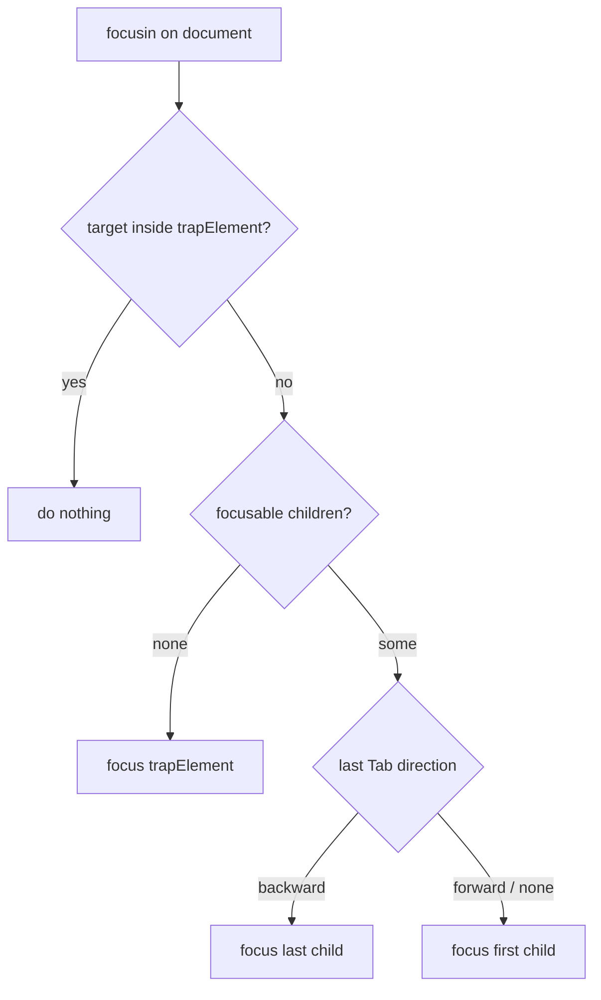

Because the listeners are registered on `document` under one shared namespace, **only one FocusTrap can be active at a time**. Modal activates its trap after the show transition (if `focus: true`). Offcanvas activates its trap unless `scroll: true` and `backdrop: false` are both set.

---

### 5. `ScrollBarHelper`: page-scroll lock without layout shift

When a modal surface opens, the page scrollbar has to be hidden. Removing it would normally make the content jump sideways by the scrollbar's width. `ScrollBarHelper` locks scrolling and adds compensating padding and margins so the layout stays put.

**API**

| Method | Description |
|---|---|
| `getWidth()` | `abs(window.innerWidth − documentElement.clientWidth)`, which is the width of the scrollbar |
| `hide()` | Sets `body{overflow:hidden}`, adds `+width` to `padding-right` on `body` and fixed content, and adds `−width` to `margin-right` on sticky content |
| `reset()` | Restores the original inline styles |
| `isOverflowing()` | `getWidth() > 0` |

**Target selectors**

- Fixed content (padding compensation): `.fixed-top, .fixed-bottom, .is-fixed, .sticky-top`
- Sticky content (negative margin): `.sticky-top`

**Style preservation.** Before it changes a property, `_saveInitialAttribute` copies any existing *inline* value into a `data-bs-<property>` attribute, for example `data-bs-padding-right`. `reset()` reads that attribute back. If the attribute exists, the inline value is restored and the attribute is removed. If it does not exist, the inline property is removed. Elements other than `body` are adjusted only if they span the full viewport width (`innerWidth <= el.clientWidth + scrollbarWidth`).

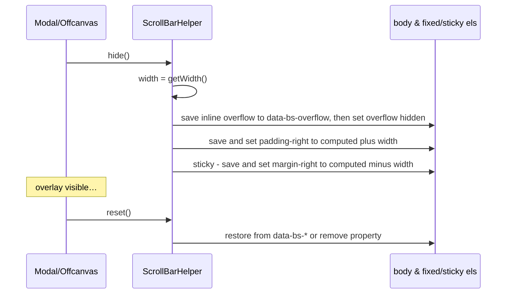

Modal keeps a single `ScrollBarHelper` instance. It also uses `getWidth()` in `_adjustDialog()` to pad the dialog. Offcanvas creates a new helper each time it shows or hides, and only when `scroll: false`.

---

### 6. `Swipe`: horizontal gesture detection

`Swipe` detects left and right swipes on touch and pen devices.

**Configuration**: `leftCallback`, `rightCallback` and `endCallback` (each a `function|null`, defaulting to `null`).

**Support detection.** `Swipe.isSupported()` returns `'ontouchstart' in document.documentElement || navigator.maxTouchPoints > 0`. If support is missing, or no element is given, the constructor returns early and binds nothing. `dispose()` is still safe to call.

**Event strategy**

| Environment | Events bound (namespace `.bs.swipe`) | Extra |
|---|---|---|
| `window.PointerEvent` available | `pointerdown`, `pointerup`. Only `pointerType` `touch` or `pen` is counted. | Adds the CSS class `pointer-event` to the element |
| Legacy touch | `touchstart`, `touchmove`, `touchend` | Multi-touch in `touchmove` resets the delta to 0 |

**Gesture evaluation** (`_handleSwipe`): a movement of |Δx| ≤ **40 px** (`SWIPE_THRESHOLD`) is ignored. Beyond that, a positive Δx calls `rightCallback` and a negative Δx calls `leftCallback`. `endCallback` runs on every gesture end, even when no swipe is recognized.

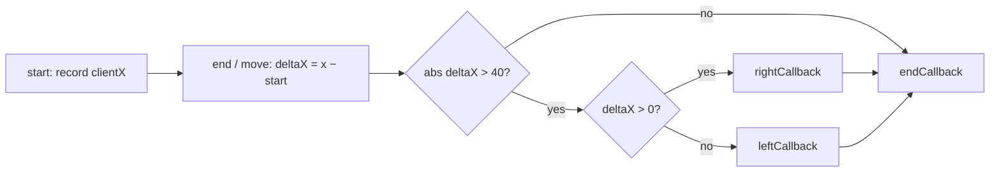

Consumer: **Carousel** maps swipe directions to next and previous slides, taking RTL into account. It uses `endCallback` to pause and later resume cycling. See [bootstrap_interactive_content_components](bootstrap_interactive_content_components.md).

---

### 7. `TemplateFactory`: safe DOM generation for floating content

`TemplateFactory` builds DOM elements from an HTML template string and a map from selectors to content, sanitizing the HTML along the way. Tooltip and Popover use it to render their tips.

**Configuration**

| Option | Default | Type |
|---|---|---|
| `allowList` | `DefaultAllowlist` | object |
| `content` | `{}` (`{ selector: entry }`) | object. Each entry is `string\|element\|function\|null`. |
| `extraClass` | `''` | string\|function |
| `html` | `false` | boolean |
| `sanitize` | `true` | boolean |
| `sanitizeFn` | `null` | function\|null |
| `template` | `'

'` | string |

`_typeCheckConfig` is overridden to also validate every `content` entry against `DefaultContentType`.

**Public API**

- `getContent()` resolves every content entry (functions are called with the factory as their argument) and returns the truthy results.
- `hasContent()` returns true if `getContent()` is not empty.
- `changeContent(content)` validates the new entries and merges them into the existing content. It returns `this`. Tooltip calls it to reuse a factory with new content.
- `toHtml()` renders the template and returns its **first child element**.

**Rendering algorithm** (`toHtml` and `_setContent`):

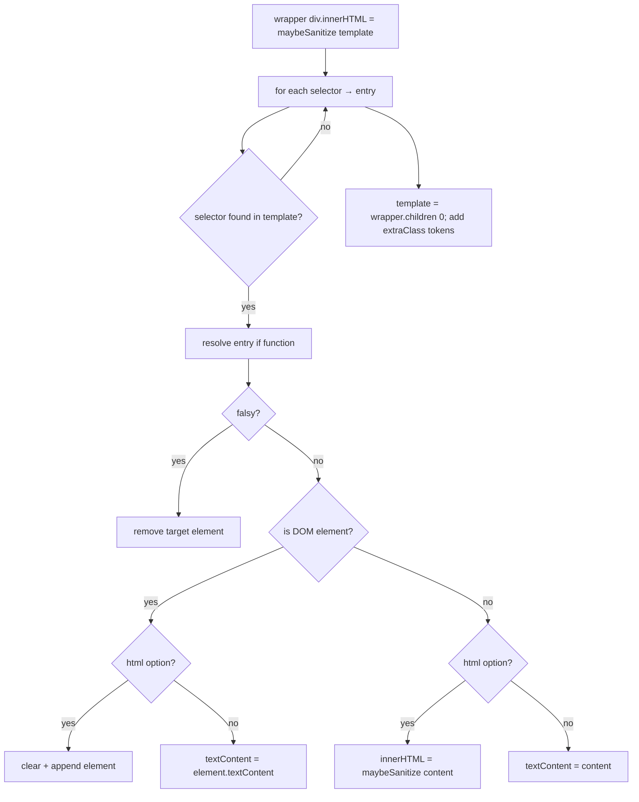

**Security.** When `sanitize` is true, `sanitizeHtml` runs on the template and on any HTML content:

- If `sanitizeFn` is supplied, it takes over the sanitizing completely.
- Otherwise the markup is parsed with `DOMParser`. Elements not in `allowList` are removed. Attributes not allowed for their element (or globally via `'*'`, which also covers `aria-*` through a regex) are stripped.
- URI attributes (`href`, `src`, `xlink:href`, …) must match `SAFE_URL_PATTERN`, which rejects `javascript:` URLs.

Tooltip additionally ignores `sanitize`, `allowList` and `sanitizeFn` if they arrive as `data-bs-*` attributes (its `DISALLOWED_ATTRIBUTES` list). This stops markup from switching off sanitization.

---

## How the Module Fits the System

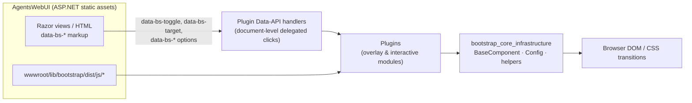

Typical flow for a declarative Modal, shown as an end-to-end example of how the infrastructure is used:

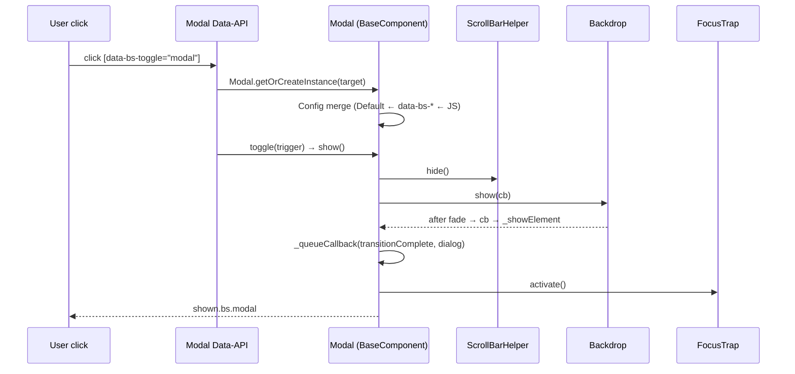

---

## Extension Guidelines

The core classes are internal and are **not exported** by any of the three builds. Only the 12 plugins are exported. Even so, when patching or studying the library, follow the conventions the core imposes:

1. **Always define `static get NAME()`.** `Config.NAME` throws, and `DATA_KEY`, `EVENT_KEY` and error messages are all derived from `NAME`.
2. **Declare `Default` and `DefaultType` together.** Every option in `DefaultType` is validated, so a missing default with a strict type fails with a `TypeError`.
3. **Use `_configAfterMerge` for coercion.** Examples are resolving selectors to elements or converting a numeric `delay` into `{show, hide}`.
4. **Namespace every listener with `EVENT_KEY`** so that `BaseComponent.dispose()` removes it automatically.
5. **Override `dispose()` for owned helpers** (Backdrop, FocusTrap, Swipe, Popper) and call `super.dispose()` last.
6. **Use `_queueCallback`** instead of raw `transitionend` listeners, so completion is guaranteed even when a CSS transition is missing or cut short.
7. **Keep one component per element.** `Data.set` rejects a second component type on an element that already holds one.

## Operational Notes

- **Popper requirement:** if you use `bootstrap.js` or `bootstrap.esm.js`, Popper must be loaded first, or Dropdown and Tooltip throw `Bootstrap's … require Popper`. `bootstrap.bundle.js` avoids this.
- **jQuery bridge:** if `window.jQuery` exists and `<body>` lacks `data-bs-no-jquery`, every plugin is also registered as `$.fn[NAME]` (with `noConflict`) once the DOM is ready, and namespaced events are also triggered through jQuery.
- **RTL:** `isRTL()` checks `document.documentElement.dir === 'rtl'`. It affects the swipe direction mapping (Carousel) and which side the Modal dialog pads on. `ScrollBarHelper` always works on `padding-right` and `margin-right`.
- **Reduced motion or no transitions:** `executeAfterTransition` computes a duration of 0 ms (plus 5 ms padding), so callbacks still run.
