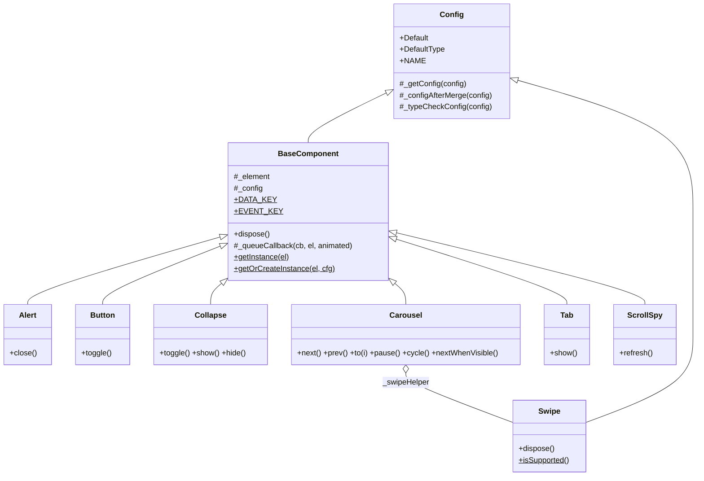
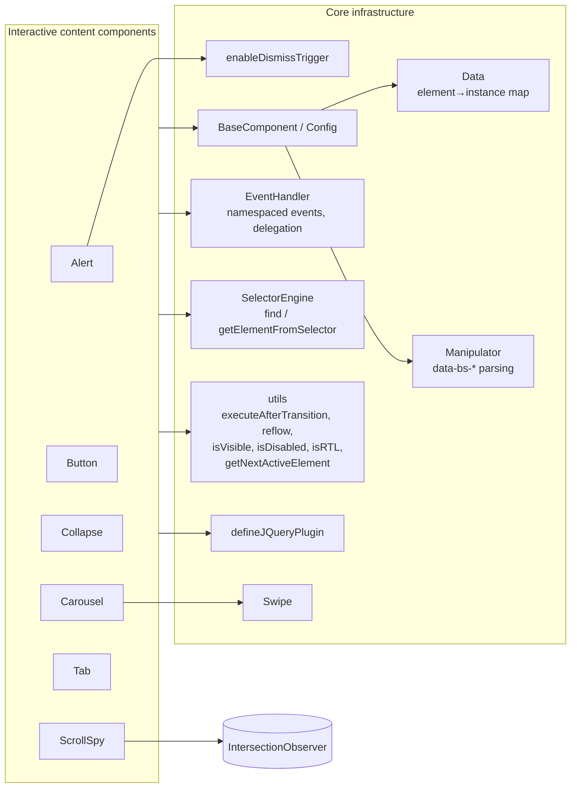
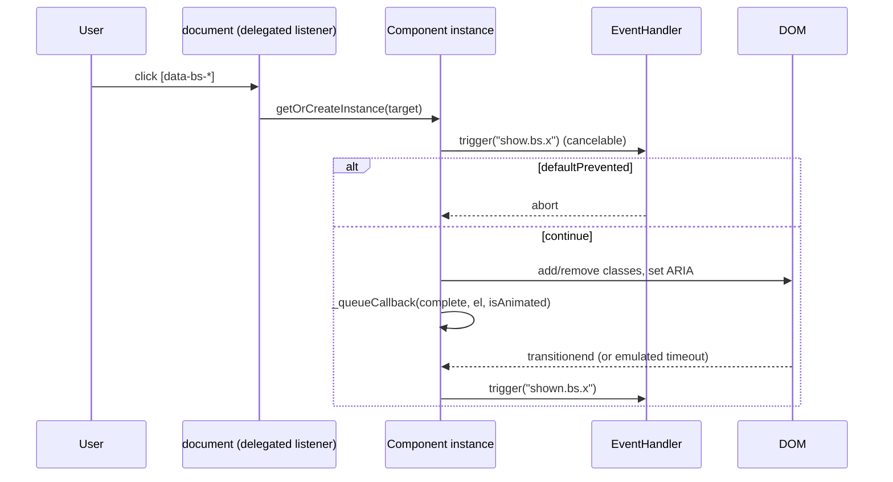
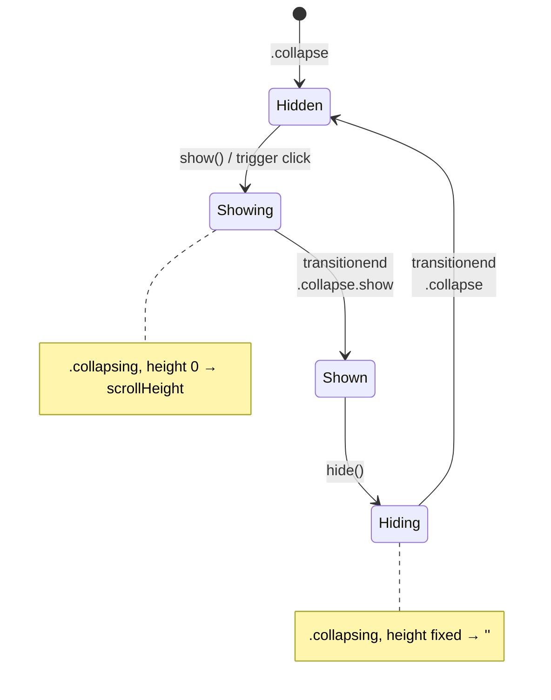
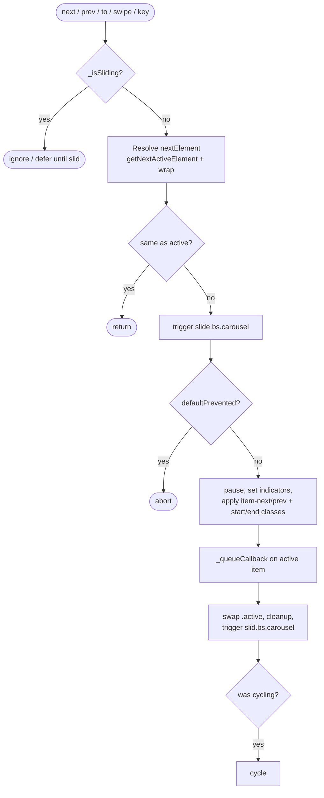
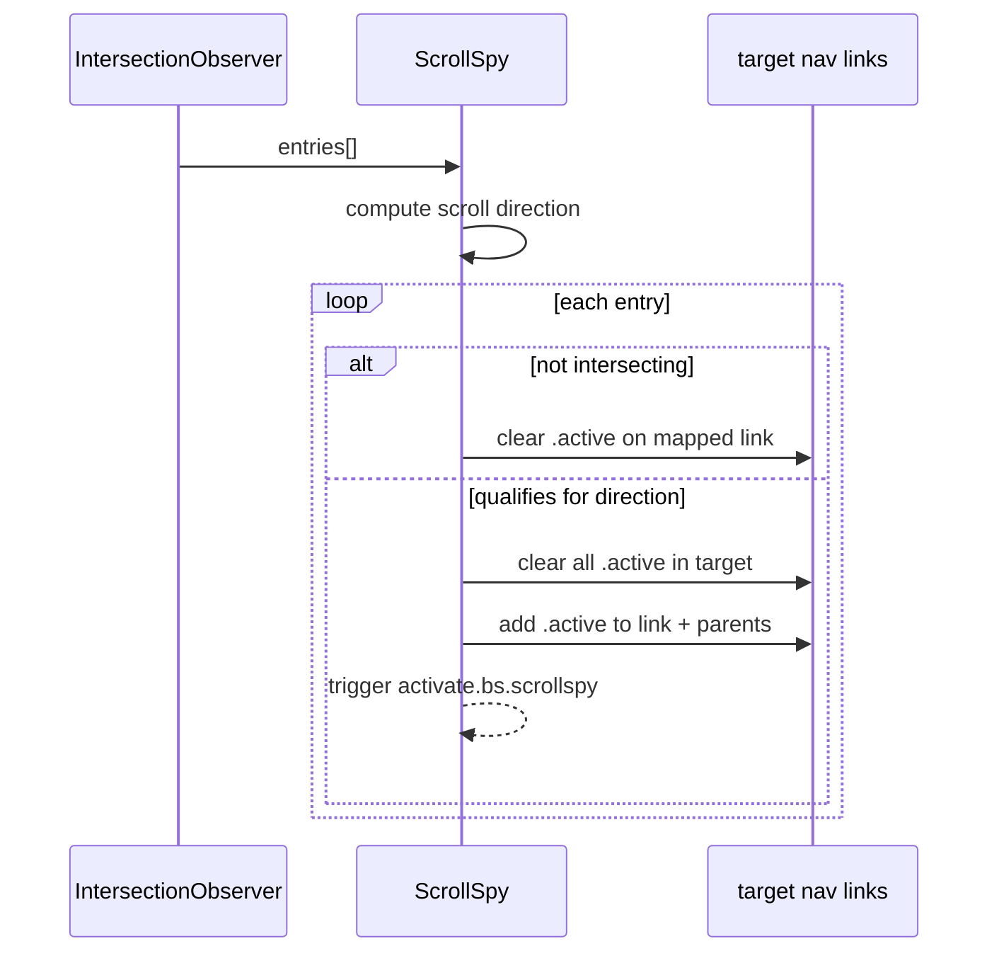

# Bootstrap Interactive Content Components

## Introduction

This module covers the **in-page interactive content widgets** from Bootstrap v5.3.3, which ships as static assets in the Agents Web UI (`0-Agents/AgentsWebUI/wwwroot/lib/bootstrap/dist/js/`). Unlike the overlay widgets (modals, dropdowns, tooltips, toasts), these components change content that is **already in the page layout**. They show, hide, cycle, toggle or highlight it, and they don't float above the page.

| Component | Purpose | `NAME` / data key |
|-----------|---------|-------------------|
| **Alert** | Dismiss (remove) a notification box | `alert` / `bs.alert` |
| **Button** | Toggle a button's pressed/active state | `button` / `bs.button` |
| **Collapse** | Expand/collapse content, including accordion groups | `collapse` / `bs.collapse` |
| **Carousel** | Cycle through slides (auto-play, keyboard, swipe) | `carousel` / `bs.carousel` |
| **Tab** | Switch between tab panes (tabs, pills, list groups) | `tab` / `bs.tab` |
| **ScrollSpy** | Highlight the nav link for the section in view | `scrollspy` / `bs.scrollspy` |

Each component has the same implementation in all three distribution files:

| File | Format | Popper handling |
|------|--------|-----------------|
| `bootstrap.js` | UMD (global `bootstrap`, AMD, CommonJS) | Needs `@popperjs/core` as an external dependency |
| `bootstrap.bundle.js` | UMD | Bundles Popper inside the file |
| `bootstrap.esm.js` | ES module (`export { Alert, Button, ... }`) | `import * as Popper from '@popperjs/core'` |

None of the six components in this module use Popper. They work the same whichever file you load.

> The shared infrastructure these components build on (`BaseComponent`, `Config`, `Swipe`, etc.) is documented in [bootstrap_core_infrastructure](bootstrap_core_infrastructure.md). Overlay widgets are documented in [bootstrap_overlay_components](bootstrap_overlay_components.md).

---

## Architecture Overview



### Shared runtime services

Every component relies on these internal helpers. They are defined once per distribution file and described in [bootstrap_core_infrastructure](bootstrap_core_infrastructure.md).



### Common lifecycle pattern

All six components follow the same lifecycle:

1. **Instantiation.** You can create an instance with `new Component(el, cfg)`, with `Component.getOrCreateInstance(el, cfg)`, or through the Data API. In all three cases, `BaseComponent` resolves the element and merges configuration in this order: `Default` → `data-bs-config` JSON → `data-bs-*` attributes → JS config object. It then type-checks the result against `DefaultType` and registers the instance in `Data` under `bs.<name>`. Only one Bootstrap instance is allowed per element.
2. **Cancelable "before" events.** Actions fire an event before they run (`close`, `show`, `hide`, `slide`). If a listener calls `preventDefault()`, the action is aborted.
3. **Transition-aware completion.** `_queueCallback` → `executeAfterTransition` waits for the CSS `transitionend` event, or for a timeout based on the computed transition duration plus 5 ms. It then fires the "after" event (`closed`, `shown`, `hidden`, `slid`).
4. **Disposal.** `dispose()` removes the `Data` entry, removes all events in the component's namespace (`.bs.<name>`), and nulls out the instance's fields.
5. **jQuery bridge.** `defineJQueryPlugin` registers `$.fn.<name>` when jQuery is present and `<body>` does not have `data-bs-no-jquery`.



---

## Component Reference

### Alert

Dismisses an alert box: it fades the box out (if animated) and then removes it from the DOM.

- **Public API:** `close()`
- **Events:** `close.bs.alert` (cancelable), then `closed.bs.alert`
- **Behavior:** `close()` removes the `show` class. If the element has the `fade` class, it waits for the transition. `_destroyElement()` then removes the element, fires `closed`, and calls `dispose()`.
- **Data API:** `enableDismissTrigger(Alert, 'close')` sets up a delegated click handler on `document` for `[data-bs-dismiss="alert"]`. The handler finds its target from `data-bs-target`/`href`, or falls back to the nearest `.alert`, and calls `close()`. It skips disabled triggers and prevents navigation on `<a>`/`<area>` triggers.

```html
<div class="alert alert-warning alert-dismissible fade show" role="alert">
  Something happened.
  <button type="button" class="btn-close" data-bs-dismiss="alert" aria-label="Close"></button>
</div>
```

### Button

A minimal toggle-button helper.

- **Public API:** `toggle()`. It toggles the `active` class and sets `aria-pressed` to the result.
- **Data API:** a delegated `click.bs.button.data-api` handler on `[data-bs-toggle="button"]` calls `preventDefault()` and then `toggle()`.
- **jQuery:** only accepts `'toggle'`. Any other string is silently ignored.

### Collapse

Shows and hides content by animating its height, or its width when the element has `.collapse-horizontal`.

| Option | Type | Default | Description |
|--------|------|---------|-------------|
| `parent` | `null \| element` (selector resolved by `getElement`) | `null` | Accordion container. Opening one item closes its first-level siblings in this parent. |
| `toggle` | `boolean` | `true` | Toggle the element on construction. |

- **Public API:** `toggle()`, `show()`, `hide()`
- **Events:** `show.bs.collapse`, `shown.bs.collapse`, `hide.bs.collapse`, `hidden.bs.collapse`
- **Trigger tracking:** the constructor finds every `[data-bs-toggle="collapse"]` whose selector resolves to this element and stores them in `_triggerArray`. When the collapse opens or closes, it updates each trigger's `aria-expanded` attribute and `collapsed` class.
- **Accordion logic:** when `parent` is set, `show()` finds first-level `.collapse.show` / `.collapse.collapsing` siblings. `_getFirstLevelChildren` excludes nested `.collapse .collapse` elements. `show()` hides those siblings first, and aborts if one of them is still transitioning.
- **Animation:** the collapse swaps classes in the sequence `collapse` → `collapsing` → `collapse show`. When showing, it sets the dimension to `0` and then to `scrollHeight`/`scrollWidth`. When hiding, it pins the current size, forces a reflow, and then clears the size.
- **Data API:** the click handler toggles **every** element matched by the trigger's selector (`getMultipleElementsFromSelector`). It creates each instance with `{toggle:false}`. It calls `preventDefault()` only for `<a>` triggers.
- **jQuery:** `'show'` and `'hide'` force `toggle:false` on creation, so the method call is not undone by the initial auto-toggle.



### Carousel

A slideshow with optional auto-cycling, indicators, keyboard control and touch swipe.

| Option | Type | Default | Description |
|--------|------|---------|-------------|
| `interval` | `number \| boolean` | `5000` | Auto-cycle delay in ms. A slide's `data-bs-interval` overrides it for that slide. |
| `keyboard` | `boolean` | `true` | ArrowLeft/ArrowRight navigation (ignored while focus is in input/textarea). |
| `pause` | `string \| boolean` | `'hover'` | Pause on `mouseenter`, resume on `mouseleave`. |
| `ride` | `boolean \| string` | `false` | `'carousel'` starts cycling on init. `true` cycles only after the first user interaction. |
| `touch` | `boolean` | `true` | Enable swipe via [`Swipe`](bootstrap_core_infrastructure.md). |
| `wrap` | `boolean` | `true` | Loop from last slide to first and first to last. |

- **Public API:** `next()`, `prev()`, `to(index)`, `pause()`, `cycle()`, `nextWhenVisible()`, `dispose()`
- **Events:** `slide.bs.carousel` (cancelable) and `slid.bs.carousel`. Both events carry `relatedTarget`, `direction` (`left`/`right`), `from` and `to`.
- **Sliding algorithm (`_slide`):**
  1. If the carousel is already sliding, return. Otherwise pick the next element with `getNextActiveElement` (which respects `wrap`), or use the explicit target.
  2. Fire `slide`. If it is canceled, abort.
  3. `pause()`, set `_isSliding`, update the indicators (`active` plus `aria-current`).
  4. Add `carousel-item-next`/`-prev` to the incoming slide, reflow, then add `carousel-item-start`/`-end` to both slides.
  5. When the transition completes (animated only if the carousel has `.slide`), swap `active`, clean up the classes, and fire `slid`. If the carousel was cycling before, restart `cycle()`.
- **Concurrency:** if you call `to(index)` or `_maybeEnableCycle()` mid-slide, the call is deferred until `slid` fires, via `EventHandler.one`.
- **Visibility guard:** `nextWhenVisible()` skips the advance when `document.hidden` is true or the carousel is not visible.
- **RTL:** `_directionToOrder` / `_orderToDirection` swap swipe and arrow directions when `<html dir="rtl">`.
- **Touch compat:** after `touchend`, the carousel pauses and resumes after `500 ms + interval`. This works around mouse-compatibility events that browsers fire after touch. It also blocks `dragstart` on slide images.
- **Data API:**
  - Clicking `[data-bs-slide]` or `[data-bs-slide-to]` targets a `.carousel` and calls `to()` / `next()` / `prev()`, then `_maybeEnableCycle()`.
  - `window` `load` initializes every `[data-bs-ride="carousel"]`.



### Tab

Activates one tab or pill/list item and its associated pane, and deactivates the currently active one within the same container.

- **Containers:** `.list-group`, `.nav`, `[role="tablist"]`
- **Triggers:** `[data-bs-toggle="tab" | "pill" | "list"]`
- **Public API:** `show()`
- **Events:**
  - The previously active tab gets `hide.bs.tab` and `hidden.bs.tab`, with `relatedTarget` set to the new tab.
  - The new tab gets `show.bs.tab` and `shown.bs.tab`, with `relatedTarget` set to the previous tab.
  - If either `hide` or `show` is prevented, the switch is aborted.
- **Activation:** `_activate` and `_deactivate` recurse once. They handle the tab element, then the pane resolved through `data-bs-target`/`href`.
  - Panes toggle `show`, respecting `.fade`.
  - Tab elements toggle `aria-selected` and `tabindex="-1"`, and emit `shown`/`hidden`.
  - Dropdown parents (`.dropdown`) get `active`/`show` and `aria-expanded` synchronized.
- **Accessibility setup:** on construction, the tab adds ARIA roles only where the element doesn't already have them: `tablist` on the container, `tab` on items, `presentation` on outer `.nav-item`, `tabpanel` and `aria-labelledby` on panes. It also sets `aria-selected` and roving `tabindex`.
- **Keyboard:** Arrow keys move through tabs (cyclic, skipping disabled tabs), and Home/End jump to the first/last tab. Focus moves with `preventScroll`, and the newly focused tab is shown immediately.
- **Data API:** a delegated click handler shows the tab, ignoring disabled triggers. On `window` `load`, the script creates instances for tabs that are already `.active`, so their keyboard handlers and ARIA are set up.

### ScrollSpy

Watches content sections with an `IntersectionObserver` and adds the `active` class to the matching navigation link.

| Option | Type | Default | Description |
|--------|------|---------|-------------|
| `target` | `element` | `null` → `document.body` | Container holding the nav links (`[href]`). |
| `rootMargin` | `string` | `'0px 0px -25%'` | Observer root margin. |
| `threshold` | `array` | `[0.1, 0.5, 1]` | Observer thresholds. Accepts a comma-separated string. |
| `smoothScroll` | `boolean` | `false` | Intercept link clicks and scroll smoothly to the section. |
| `offset` | `number \| null` | `null` | **Deprecated.** When set, it overrides `rootMargin` as `${offset}px 0px -30%`. |

- **Public API:** `refresh()` rebuilds the link and section maps and re-observes. `dispose()` disconnects the observer.
- **Events:** `activate.bs.scrollspy`, with `relatedTarget` set to the newly active link. It fires on the spied element.
- **Root detection:** if the spied element has `overflow-y: visible`, the viewport is the root. Otherwise the element itself is the scroll root.
- **Mapping:** each non-disabled `[href]` with a hash inside `target` maps to a visible section with that id inside the spied element.
- **Selection logic (`_observerCallback`):**
  - The callback tracks scroll direction by comparing the current `scrollTop` with the previous one.
  - Scrolling down: activate intersecting entries whose `offsetTop` is at or below the last activated one. At scroll position 0, it keeps the first visible entry.
  - Scrolling up: activate entries above the last activated one.
  - Entries that stop intersecting have their link's `active` class cleared.
- **Parent activation:** for dropdown items, the parent `.dropdown-toggle` becomes active. For links nested in `.nav` / `.list-group` containers, the preceding `.nav-link` / `.list-group-item` of each ancestor list becomes active.
- **Data API:** on `window` `load`, every `[data-bs-spy="scroll"]` is initialized.



---

## Data API Summary

| Component | Declarative attribute(s) | Listener scope / event |
|-----------|--------------------------|-------------------------|
| Alert | `data-bs-dismiss="alert"` | `document` `click.dismiss.bs.alert` |
| Button | `data-bs-toggle="button"` | `document` `click.bs.button.data-api` |
| Collapse | `data-bs-toggle="collapse"`, `data-bs-target`/`href`, `data-bs-parent` | `document` `click.bs.collapse.data-api` |
| Carousel | `data-bs-ride="carousel"`, `data-bs-slide="next\|prev"`, `data-bs-slide-to`, `data-bs-interval` | `document` click; `window` `load.bs.carousel.data-api` |
| Tab | `data-bs-toggle="tab\|pill\|list"`, `data-bs-target`/`href` | `document` `click.bs.tab`; `window` `load.bs.tab` |
| ScrollSpy | `data-bs-spy="scroll"`, `data-bs-target`, `data-bs-smooth-scroll`, `data-bs-root-margin`, `data-bs-threshold` | `window` `load.bs.scrollspy.data-api` |

All options can also be supplied as JSON in `data-bs-config`, or as individual `data-bs-<option>` attributes. `Manipulator` parses these attributes and converts `"true"`/`"false"`, numbers, `"null"` and JSON strings into typed values.

## Programmatic Usage

```js
// UMD (bootstrap.js / bootstrap.bundle.js)
const collapse = bootstrap.Collapse.getOrCreateInstance('#details', { toggle: false });
collapse.show();

const carousel = bootstrap.Carousel.getOrCreateInstance(document.querySelector('#hero'), { interval: 3000 });
carousel.to(2);

document.querySelector('#hero').addEventListener('slide.bs.carousel', e => {
  if (e.to === 0) e.preventDefault(); // cancel sliding back to the first slide
});

// ESM
import { Tab, ScrollSpy } from './lib/bootstrap/dist/js/bootstrap.esm.js';
Tab.getOrCreateInstance(document.querySelector('#profile-tab')).show();
```

## Relationship to Other Modules

- **[bootstrap_core_infrastructure](bootstrap_core_infrastructure.md)** provides `BaseComponent`, `Config`, and `Swipe` (used by Carousel). It also provides the event, selector, data and utility layers used throughout this module.
- **[bootstrap_overlay_components](bootstrap_overlay_components.md)** covers the sibling widgets (Modal, Offcanvas, Dropdown, Tooltip, Popover, Toast). A few points of contact:
  - Tab can host dropdown menus, and synchronizes their `active`/`show` state without instantiating `Dropdown`.
  - ScrollSpy highlights `.dropdown-toggle` parents.
  - Alert shares the `enableDismissTrigger` mechanism with Modal, Offcanvas and Toast.

## Notes and Caveats

- **One instance per element.** Creating a second Bootstrap component on an element that already has one logs a console error and does not register the new instance.
- **Tab without a container.** If a Tab's element has no valid container, the constructor returns without wiring anything up. v5 does not throw here.
- **Carousel interval.** Passing `interval: false` together with `ride` is legacy behavior, and boolean `interval` support is marked for removal in v6.
- **ScrollSpy `offset`.** The `offset` option and implicit `document.body` targeting are deprecated, and the source marks them for removal in v6.
- **`dispose()` scope.** Components remove only their own namespaced listeners. Document-level Data API listeners stay registered for the whole page.
