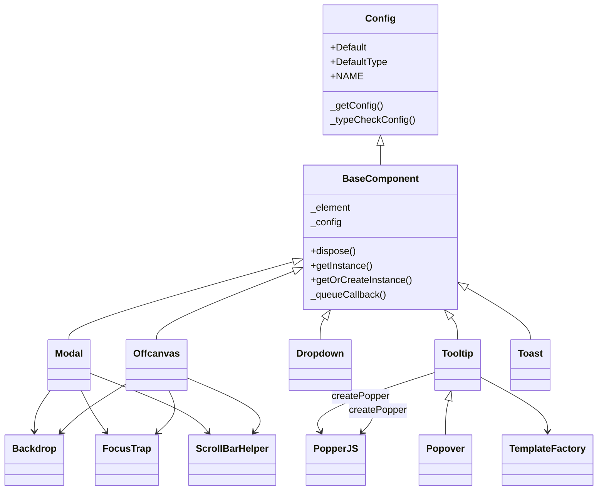
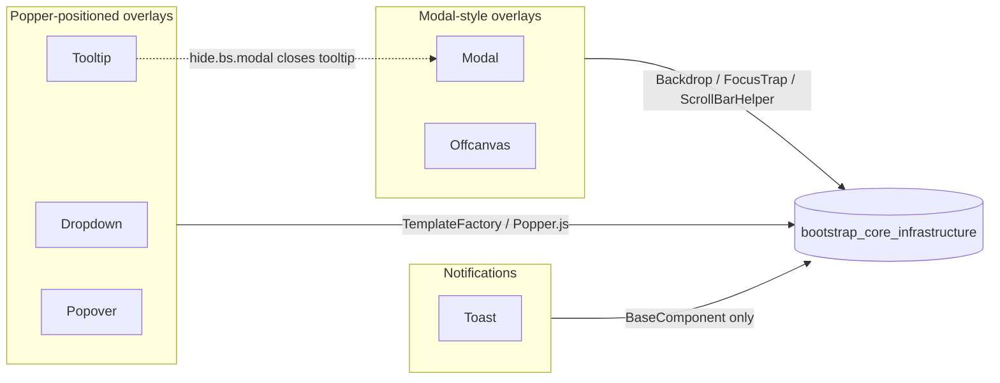
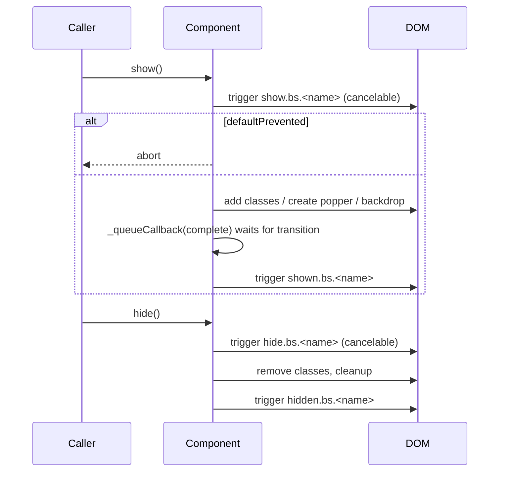

# bootstrap_overlay_components

## Introduction

`bootstrap_overlay_components` documents the **overlay / floating-layer UI components** of the Bootstrap v5.3.3 JavaScript library vendored into the Agents Web UI (`0-Agents/AgentsWebUI/wwwroot/lib/bootstrap/dist/js/`). These components render content *on top of* the normal page flow: modal dialogs, side panels, dropdown menus, tooltips, popovers and toast notifications.

| Component | Purpose | Positioning strategy |
|-----------|---------|----------------------|
| `Modal` | Blocking dialog window with backdrop, focus trap and scroll lock | Fixed, centered (CSS) |
| `Offcanvas` | Sliding side/top/bottom panel | Fixed edge (CSS) |
| `Dropdown` | Toggleable menu anchored to a trigger | Popper.js |
| `Tooltip` | Small hint shown on hover/focus | Popper.js + generated template |
| `Popover` | Richer tooltip (header + body), click-triggered by default | Popper.js (inherits Tooltip) |
| `Toast` | Non-blocking, auto-hiding notification | Static/CSS |

The same six classes are shipped in three distribution flavours (identical logic):

| File | Format | Popper.js |
|------|--------|-----------|
| `bootstrap.bundle.js` | UMD (`window.bootstrap`) | **Embedded** (Popper core is inlined) |
| `bootstrap.js` | UMD | External – `require('@popperjs/core')` / `global.Popper` |
| `bootstrap.esm.js` | ES module (`export { Modal, ... }`) | External – `import * as Popper from '@popperjs/core'` |

> Shared foundations (`BaseComponent`, `Config`, `Backdrop`, `FocusTrap`, `ScrollBarHelper`, `TemplateFactory`, `Swipe`) are documented in [bootstrap_core_infrastructure](bootstrap_core_infrastructure.md). In-page, non-overlay widgets (`Alert`, `Button`, `Collapse`, `Carousel`, `Tab`, `ScrollSpy`) are documented in [bootstrap_interactive_content_components](bootstrap_interactive_content_components.md).

## Architecture Overview

The components fall into three natural families:

### Common runtime infrastructure

All components rely on the internal helpers defined at the top of each bundle:

- **`Data`** – a `Map<Element, Map<key, instance>>` registry enforcing one instance per element (`bs.modal`, `bs.tooltip`, ...).
- **`EventHandler`** – namespaced event registration (`show.bs.modal`), delegation, one-shot handlers and jQuery-compatible `trigger()` returning cancelable events.
- **`SelectorEngine`** – DOM queries, `data-bs-target`/`href` resolution, focusable-children lookup.
- **`Manipulator`** – reads `data-bs-*` attributes into typed config values.
- **`executeAfterTransition`** – waits for `transitionend` (with a timeout fallback) before running completion callbacks.
- **`enableDismissTrigger`** – wires `[data-bs-dismiss="<name>"]` buttons to `hide()` (used by Modal, Offcanvas, Toast).
- **`defineJQueryPlugin`** – exposes `$.fn.modal`, `$.fn.tooltip`, ... when jQuery is present.

### Uniform lifecycle and event contract

Every overlay follows the same cancelable event pattern:

Modal and Offcanvas additionally emit `hidePrevented.bs.*` when a static backdrop or disabled keyboard blocks dismissal; Tooltip/Popover emit `inserted.bs.*` when the tip is first attached to the DOM.

### Initialization modes

1. **Data API (declarative)** – document-level delegated listeners, e.g. `[data-bs-toggle="modal"]`, `[data-bs-toggle="offcanvas"]`, `[data-bs-toggle="dropdown"]`, `[data-bs-dismiss="toast"]`. Tooltip and Popover are **opt-in only** and must be created programmatically.
2. **Programmatic** – `bootstrap.Modal.getOrCreateInstance(el, config).show()`.
3. **jQuery** – `$(el).modal('show')`.

Configuration is merged in order: component `Default` → `data-bs-config` JSON → individual `data-bs-*` attributes → JS config object, then type-checked against `DefaultType`.

## Sub-modules

| Sub-module | Components | Summary |
|------------|------------|---------|
| [Modal-style overlays](bootstrap_overlay_components_modal_dialogs.md) | `Modal`, `Offcanvas` | Full-screen/edge panels using backdrop, focus trapping, scrollbar compensation, ESC and backdrop-click dismissal, `static` backdrop semantics. |
| [Popper-positioned overlays](bootstrap_overlay_components_popper_positioned.md) | `Dropdown`, `Tooltip`, `Popover` | Elements anchored to a reference via Popper.js; placement/offset/boundary configuration, RTL-aware placements, keyboard navigation (Dropdown), trigger management and sanitized templates (Tooltip/Popover). |
| [Toast notifications](bootstrap_overlay_components_toast.md) | `Toast` | Lightweight notifications with auto-hide timer paused on mouse/keyboard interaction. |

Related modules: [bootstrap_core_infrastructure](bootstrap_core_infrastructure.md) (shared base classes and helpers) · [bootstrap_interactive_content_components](bootstrap_interactive_content_components.md) (in-page widgets).

## Integration in the Agents Web UI

These files are static client-side assets served from `wwwroot/lib/bootstrap`. Razor views/pages typically load `bootstrap.bundle.js` (no separate Popper dependency needed), after which all overlays are available through data attributes or `window.bootstrap`. No server-side code interacts with them directly.
