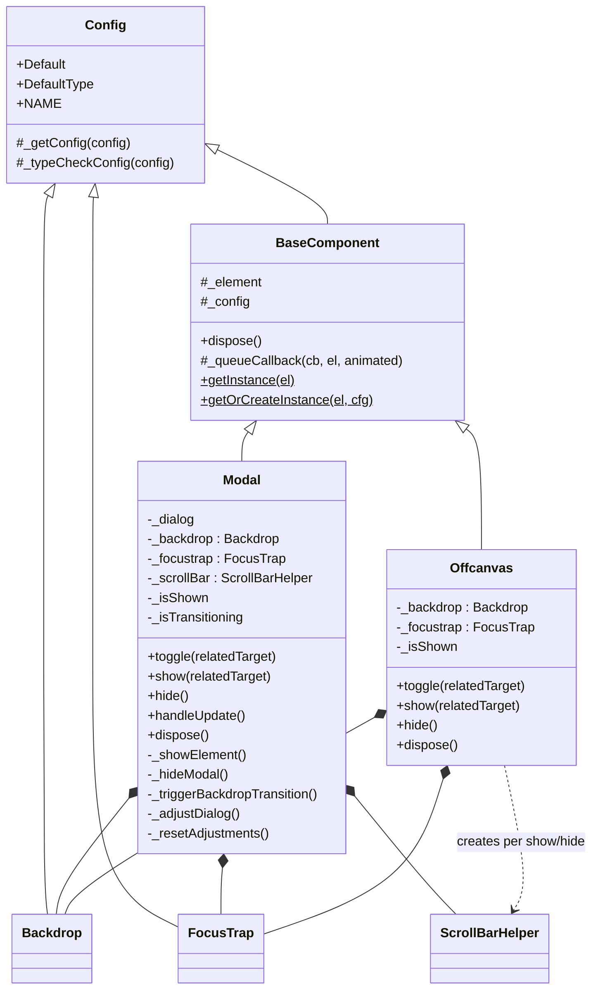
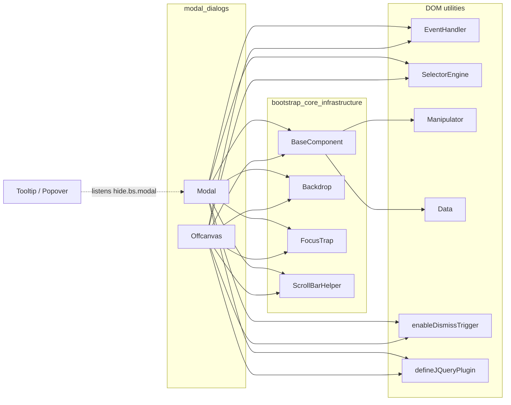
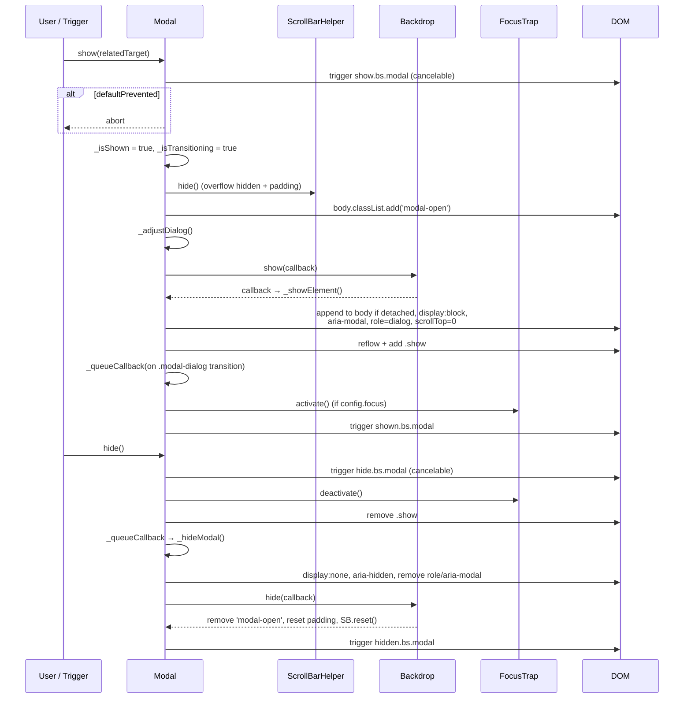
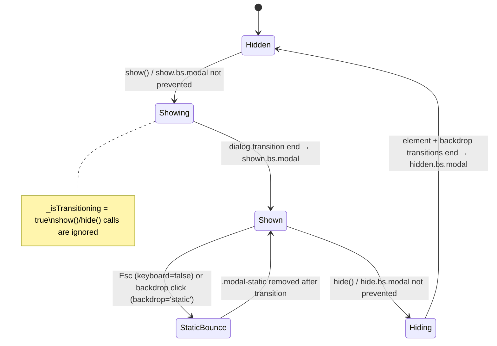
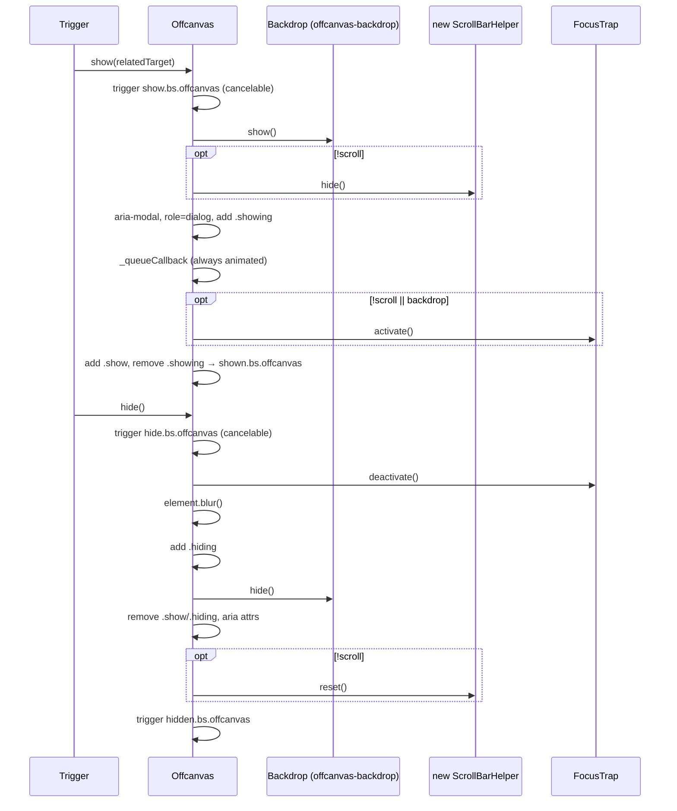
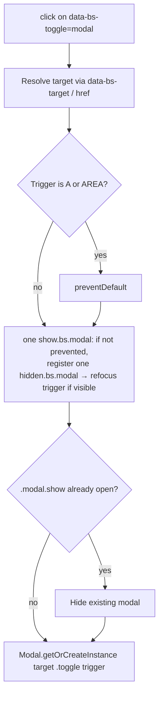

# Bootstrap Overlay Components – Modal Dialogs (`Modal`, `Offcanvas`)

## Introduction

This module covers Bootstrap v5.3.3's two **blocking overlay** components in the AgentsWebUI front end:

| Component | Purpose | Typical markup |
|-----------|---------|----------------|
| `Modal` | Centered dialog over the page. Used for confirmations, forms and detail views. | `.modal > .modal-dialog > .modal-content` |
| `Offcanvas` | Panel that slides in from one edge of the viewport. Used for side navigation, filters and drawers. | `.offcanvas.offcanvas-start/end/top/bottom` |

The two components work the same way. Each one:

- is a subclass of `BaseComponent`
- uses a `Backdrop` to dim and block the rest of the page
- uses a `FocusTrap` to keep keyboard focus inside the dialog
- uses `ScrollBarHelper` to lock page scrolling and make up for the hidden scrollbar's width
- sets the `role="dialog"` and `aria-modal` attributes and returns focus to the trigger element when it closes
- fires cancelable lifecycle events: `show`, `shown`, `hide`, `hidden` and `hidePrevented`

The same code ships in three bundles under `0-Agents/AgentsWebUI/wwwroot/lib/bootstrap/dist/js/`:

| File | Format | Popper |
|------|--------|--------|
| `bootstrap.bundle.js` | UMD (global `bootstrap`) | Bundled inline |
| `bootstrap.js` | UMD | External `@popperjs/core` |
| `bootstrap.esm.js` | ES module (`export { Modal, Offcanvas, … }`) | Imported from `@popperjs/core` |

`Modal` and `Offcanvas` do not use Popper. Their behavior is identical in all three bundles.

### Related documentation

- [bootstrap_overlay_components](bootstrap_overlay_components.md): the parent module, an overview of all overlay components.
- [bootstrap_core_infrastructure](bootstrap_core_infrastructure.md): `BaseComponent`, `Config`, `Backdrop`, `FocusTrap` and `ScrollBarHelper`. This page does not repeat them.
- [bootstrap_overlay_components_popper_positioned](bootstrap_overlay_components_popper_positioned.md): `Dropdown`, `Tooltip` and `Popover`. `Tooltip` watches `hide.bs.modal` so it can close itself when its parent modal closes.
- [bootstrap_overlay_components_toast](bootstrap_overlay_components_toast.md): `Toast`, a non-blocking notification.
- [bootstrap_interactive_content_components](bootstrap_interactive_content_components.md): `Alert`, `Collapse`, `Tab` and the other content components.

---

## Architecture



### Dependencies



---

## Modal

### Configuration

Options are merged in this order, with later sources winning: `Default`, then JSON in `data-bs-config`, then `data-bs-*` attributes, then the constructor object. `Config._typeCheckConfig` validates the result.

| Option | Type | Default | Meaning |
|--------|------|---------|---------|
| `backdrop` | `boolean \| 'static'` | `true` | `true`: a backdrop is shown and clicking it closes the modal. `'static'`: a backdrop is shown but clicking it does not close the modal; the modal plays a "bounce" animation instead. `false`: no backdrop. |
| `focus` | `boolean` | `true` | Turns on the `FocusTrap` once the modal is shown. |
| `keyboard` | `boolean` | `true` | Escape closes the modal. If `false`, Escape plays the static "bounce" animation instead. |

### Public API

| Method | Description |
|--------|-------------|
| `show(relatedTarget?)` | Opens the modal. Does nothing if the modal is already shown or is mid-transition. |
| `hide()` | Closes the modal. Does nothing if the modal is not shown or is mid-transition. |
| `toggle(relatedTarget?)` | Calls `show` or `hide`, depending on the current state. |
| `handleUpdate()` | Recalculates the padding adjustment. Call it after the modal's height changes. |
| `dispose()` | Removes listeners on `window` and the dialog, disposes the backdrop, turns off the focus trap, and then calls `BaseComponent.dispose()`. |
| `Modal.getInstance(el)` / `Modal.getOrCreateInstance(el, cfg)` | Static helpers inherited from `BaseComponent`. |

### Events (namespace `.bs.modal`)

| Event | Cancelable | Fired when | `relatedTarget` |
|-------|-----------|------------|-----------------|
| `show.bs.modal` | yes | At the start of `show()` | trigger element |
| `shown.bs.modal` | – | After the fade-in finishes and focus is trapped | trigger element |
| `hide.bs.modal` | yes | At the start of `hide()` | – |
| `hidden.bs.modal` | – | After the backdrop is removed and scrolling is restored | – |
| `hidePrevented.bs.modal` | yes | Something tried to close a static or non-keyboard modal | – |

### Show / hide sequence



### State machine



### Dismissal rules

- **Escape key** (`keydown.dismiss.bs.modal` on the modal element): if `keyboard` is on, the modal closes. Otherwise `_triggerBackdropTransition()` runs.
- **Backdrop click**: the modal pairs a `mousedown` listener with a one-time `click` listener. It only reacts when both events land on the `.modal` element itself, outside `.modal-dialog`. This skips drags that start inside the dialog and clicks on the scrollbar. With `backdrop: 'static'` the click plays the bounce animation. With any other truthy value the modal closes.
- **`[data-bs-dismiss="modal"]`**: registered by `enableDismissTrigger(Modal)`. It finds the closest `.modal`, or the element named in `data-bs-target`, and calls `hide()`.

`_triggerBackdropTransition()` fires `hidePrevented.bs.modal`. It then adds `.modal-static`, and adds `overflow-y: hidden` if the modal does not overflow the viewport. After two dialog transitions it restores the original state and focuses the modal. The method returns early if a bounce is already in progress.

### Scrollbar and overflow compensation

`_adjustDialog()` works out whether the page or the modal is overflowing:

- **Body overflows, modal does not**: adds padding equal to the scrollbar width on the right, or on the left in RTL.
- **Body does not overflow, modal does**: adds the padding on the opposite side.

It runs on `show()`, on `handleUpdate()`, and on `resize.bs.modal` from `window`, but only while the modal is shown and not transitioning. `_resetAdjustments()` clears the padding when the modal hides.

---

## Offcanvas

### Configuration

| Option | Type | Default | Meaning |
|--------|------|---------|---------|
| `backdrop` | `boolean \| 'static'` | `true` | Shows an `.offcanvas-backdrop`. `'static'`: clicking the backdrop fires `hidePrevented` instead of closing. |
| `keyboard` | `boolean` | `true` | Escape closes the panel. If `false`, Escape fires `hidePrevented`. |
| `scroll` | `boolean` | `false` | `false`: body scrolling is locked through `ScrollBarHelper`. `true`: the page can still scroll. |

### How it differs from Modal

| Aspect | Modal | Offcanvas |
|--------|-------|-----------|
| Backdrop class / parent | `modal-backdrop` appended to `body` | `offcanvas-backdrop` appended to the panel's parent node |
| Backdrop animation | Only if the modal has `.fade` | Always animated |
| Backdrop click handling | Handled by the modal element's mousedown/click listeners | Handled by the backdrop's `clickCallback` |
| Show sequencing | The dialog is shown after the backdrop finishes (callback chain) | The backdrop and panel animate at the same time |
| Transition classes | `.show` | `.showing` → `.show`, and `.hiding` when closing |
| ScrollBarHelper | One instance, kept for the component's lifetime | A new instance on each show/hide, and only when `scroll` is `false` |
| Focus trap | Turned on when `focus` is `true` | Turned on when `!scroll \|\| backdrop` |
| Static feedback | Bounce animation (`.modal-static`) | Only the `hidePrevented.bs.offcanvas` event |
| Mid-transition guard | `_isTransitioning` flag | None; only `_isShown` is checked |
| `hide()` extras | – | Calls `element.blur()` |

### Events (namespace `.bs.offcanvas`)

The events are `show`, `shown`, `hide`, `hidden` and `hidePrevented`. `show` and `shown` carry `relatedTarget`, which is the trigger element.

### Lifecycle



### Document and window handlers

| Listener | Behavior |
|----------|----------|
| `click.bs.offcanvas.data-api` on `[data-bs-toggle="offcanvas"]` | Calls `preventDefault` for `<a>` and `<area>` elements and skips disabled triggers. It registers a one-time handler that returns focus to the trigger on `hidden`, closes any other open `.offcanvas.show`, and then calls `toggle(this)`. |
| `load.bs.offcanvas.data-api` on `window` | Finds every `.offcanvas.show` already in the markup, creates an instance for it and calls `show()`. |
| `resize.bs.offcanvas` on `window` | Hides any open responsive offcanvas (such as `.offcanvas-lg`) whose computed `position` is no longer `fixed`, meaning the breakpoint now renders it inline. |
| `enableDismissTrigger(Offcanvas)` | Wires up `[data-bs-dismiss="offcanvas"]`. |

---

## Data API (Modal)



Only one modal can be open at a time through the Data API: clicking a second trigger closes the first modal. Offcanvas works the same way, but it skips the hide call when the open panel is the target itself.

---

## Usage in AgentsWebUI

**Declarative usage:**

```html
<button data-bs-toggle="modal" data-bs-target="#agentDetails">Details</button>

<div class="modal fade" id="agentDetails" tabindex="-1" aria-hidden="true"
     data-bs-backdrop="static" data-bs-keyboard="false">
  <div class="modal-dialog">
    <div class="modal-content">
      <div class="modal-body">…</div>
      <button class="btn-close" data-bs-dismiss="modal"></button>
    </div>
  </div>
</div>

<div class="offcanvas offcanvas-start" id="agentNav" data-bs-scroll="true">…</div>
```

**Programmatic usage** (UMD global from `bootstrap.bundle.js`):

```js
const modal = bootstrap.Modal.getOrCreateInstance('#agentDetails', { backdrop: true });
document.getElementById('agentDetails')
  .addEventListener('hide.bs.modal', e => { if (hasUnsavedChanges()) e.preventDefault(); });
modal.show();
```

If jQuery is loaded and `<body>` does not have `data-bs-no-jquery`, `defineJQueryPlugin` also registers `$(el).modal('show')` and `$(el).offcanvas('toggle')`.

## Notes and caveats

- **One instance per element.** `Data.set` logs an error if a different component is created on the same element.
- **Tabindex.** Set `tabindex="-1"` on `.modal` and `.offcanvas`. Autofocus and the static bounce both call `element.focus()`.
- **Dynamic modals.** A modal element that is not in the document is appended to `document.body` when it is first shown.
- **Transitions.** Transition timing comes from `executeAfterTransition`: a `transitionend` listener, with a fallback timeout of the CSS duration plus 5 ms. See [bootstrap_core_infrastructure](bootstrap_core_infrastructure.md).
- **Nesting modals.** Nesting is not supported. The Data API closes the modal that is already open, and a single document-level `FocusTrap` handles one trap element at a time.
