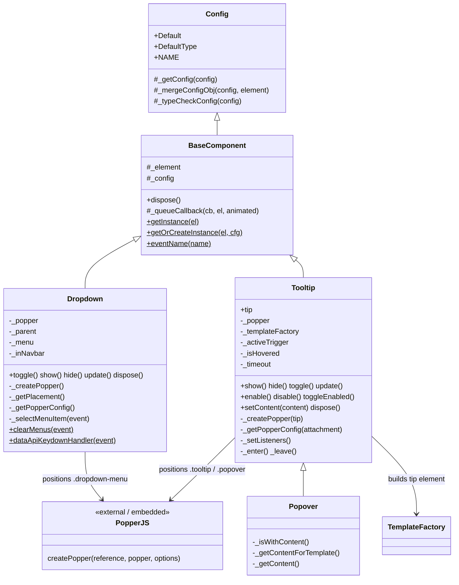
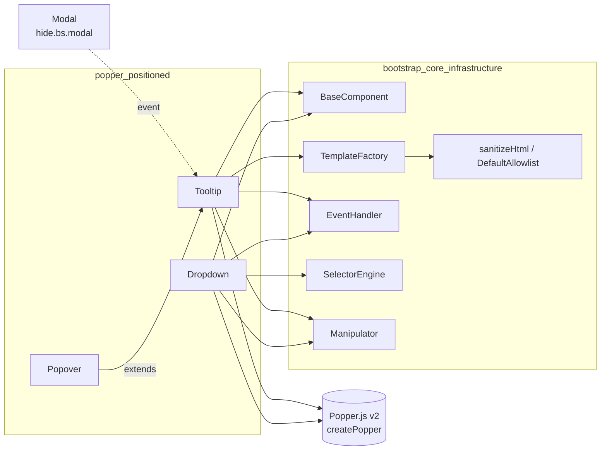
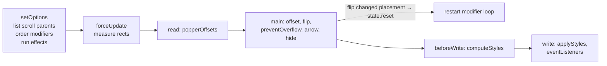
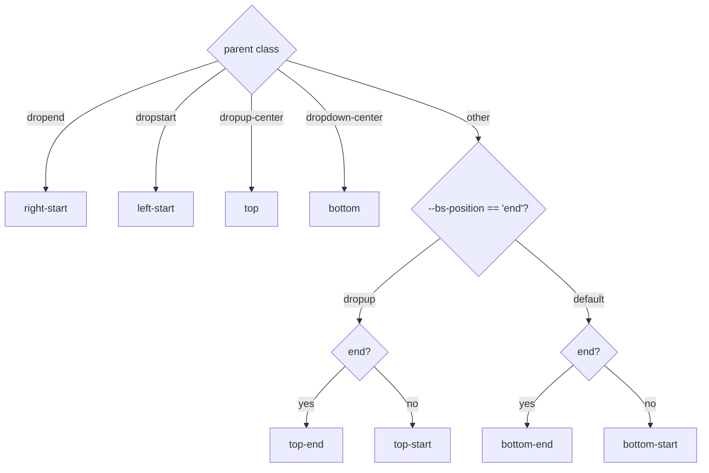
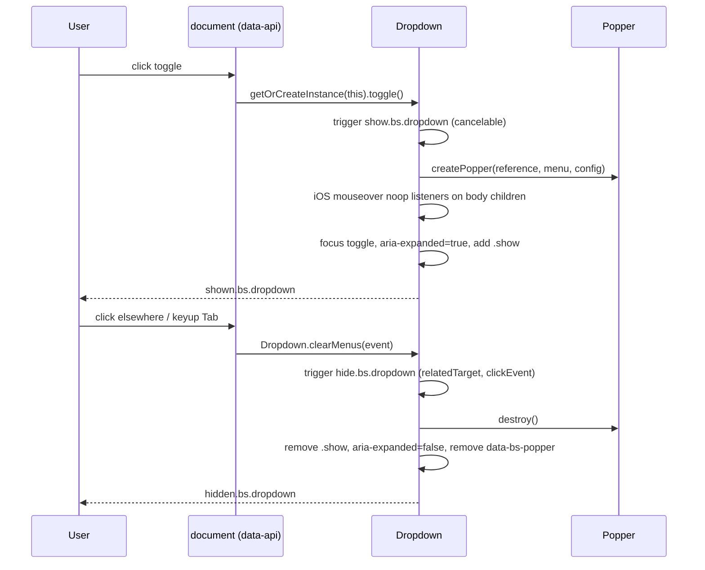
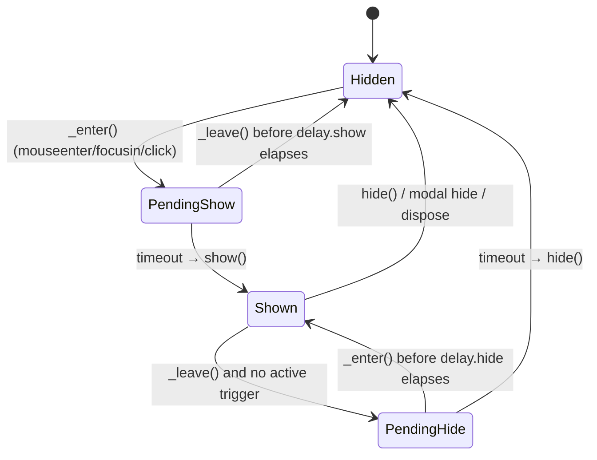
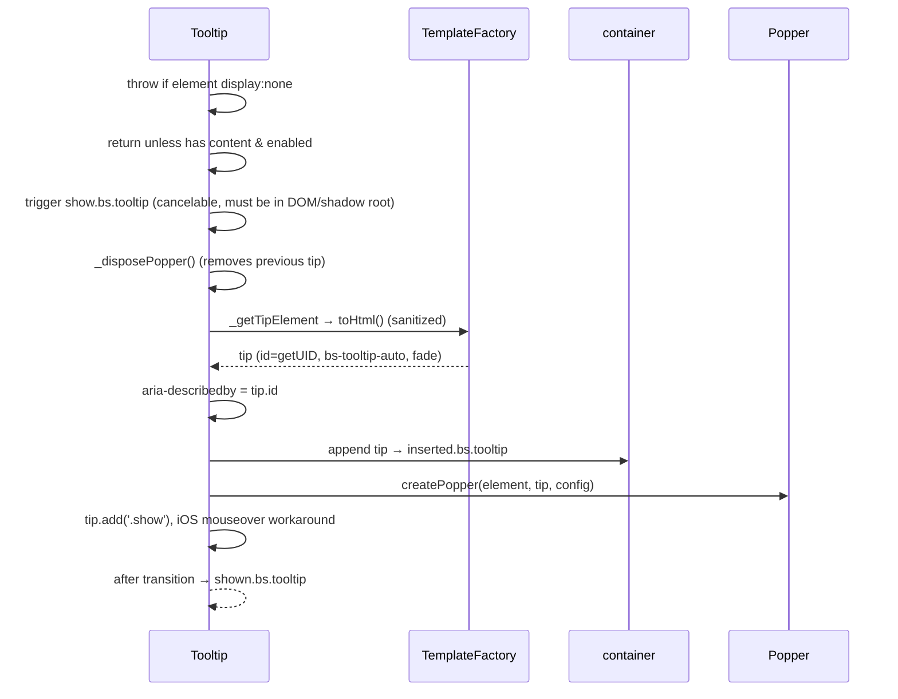

# Bootstrap Overlay Components – Popper-Positioned (`Dropdown`, `Tooltip`, `Popover`)

## Introduction

This module covers the three Bootstrap v5.3.3 components whose floating element is **positioned relative to a reference element by the Popper.js engine**:

| Component | Floating element | Default trigger | Purpose |
|-----------|------------------|-----------------|---------|
| `Dropdown` | Existing `.dropdown-menu` in the DOM | click on `[data-bs-toggle="dropdown"]` | Toggleable menus with keyboard navigation and auto-close |
| `Tooltip` | Tip built at runtime from a template | `hover focus` | Short text hints attached to an element |
| `Popover` | Tip built at runtime (header + body) | `click` | Richer tooltip with title and content (subclass of `Tooltip`) |

These components ship in the web UI's static assets at `0-Agents/AgentsWebUI/wwwroot/lib/bootstrap/dist/js/` in three builds:

| File | Module format | How Popper is obtained |
|------|---------------|------------------------|
| `bootstrap.bundle.js` | UMD (`window.bootstrap`) | **Embedded** Popper v2 (`createPopper` with the full default modifier set) |
| `bootstrap.js` | UMD | External: `require('@popperjs/core')` / AMD / `global.Popper` (accessed as `Popper__namespace`) |
| `bootstrap.esm.js` | ES module | `import * as Popper from '@popperjs/core'` |

The component logic is identical across the three files. Only the way `createPopper` is resolved differs. If you load `bootstrap.js` or `bootstrap.esm.js` without Popper, `Dropdown#show()` and the `Tooltip`/`Popover` constructors throw `TypeError: Bootstrap's dropdowns/tooltips require Popper`. The UMD build always passes that check, so a missing Popper only shows up as a failure when `createPopper` is actually called.

Related modules:
- [bootstrap_core_infrastructure](bootstrap_core_infrastructure.md): `BaseComponent`, `Config`, `TemplateFactory` and the shared helpers (EventHandler, SelectorEngine, Manipulator, Data) that these components are built on.
- [bootstrap_overlay_components](bootstrap_overlay_components.md): parent module that groups all overlay components.
- [bootstrap_overlay_components_modal_dialogs](bootstrap_overlay_components_modal_dialogs.md): `Modal` and `Offcanvas`. Tooltips hide themselves when their enclosing modal hides.
- [bootstrap_overlay_components_toast](bootstrap_overlay_components_toast.md): `Toast`.
- [bootstrap_interactive_content_components](bootstrap_interactive_content_components.md): `Tab` and `ScrollSpy`, which interact with dropdown markup (`.dropdown-toggle`, `.dropdown-menu`).

---

## Architecture



`Config`, `BaseComponent` and `TemplateFactory` are documented in [bootstrap_core_infrastructure](bootstrap_core_infrastructure.md).

### Dependency map



---

## Popper integration

All three components build a Popper options object with a Bootstrap default configuration, and then let the user extend or override it:

```js
return {
  ...defaultBsPopperConfig,
  ...execute(this._config.popperConfig, [defaultBsPopperConfig])
};
```

`popperConfig` can be `null`, an object (shallow-merged over the defaults), or a function that receives the defaults and returns the options to merge.

### Modifiers used by each component

| Modifier | Dropdown | Tooltip / Popover |
|----------|:--------:|:-----------------:|
| `preventOverflow` (`boundary` option) | ✔ | ✔ |
| `offset` (from `_getOffset()`) | ✔ | ✔ |
| `flip` (`fallbackPlacements`) | default | ✔ configured |
| `arrow` (`.tooltip-arrow` / `.popover-arrow`) | – | ✔ |
| custom `preSetPlacement` (phase `beforeMain`) | – | ✔ writes `data-popper-placement` on the tip so the arrow size is measured correctly |
| `applyStyles` | disabled when in `.navbar` or `display: 'static'` | default |

### Offset normalization (`_getOffset`)
- `"0,8"` string → `[0, 8]` (each part parsed with `parseInt`)
- function → wrapped as `popperData => offset(popperData, this._element)`
- array → passed through unchanged

### Embedded Popper pipeline (bundle build)

`bootstrap.bundle.js` contains Popper's `popperGenerator`. The resulting `createPopper` runs its modifiers in phase order:



The `eventListeners` modifier attaches `scroll` and `resize` listeners that call `instance.update()`, which is debounced to run once per microtask. Calling `destroy()` removes those listeners and resets the inline styles.

---

## Dropdown

### Construction
- `_element`: the toggle (`[data-bs-toggle="dropdown"]`).
- `_parent`: the toggle's `parentNode` (the dropdown wrapper).
- `_menu`: the next sibling `.dropdown-menu`. If there is none, the previous sibling. If there is still none, the first `.dropdown-menu` inside `_parent` (a workaround for input groups).
- `_inNavbar`: `true` when the toggle is inside `.navbar`.

### Options

| Option | Default | Type | Notes |
|--------|---------|------|-------|
| `autoClose` | `true` | boolean \| string | `true`, `false`, `'inside'`, `'outside'` |
| `boundary` | `'clippingParents'` | string \| element | Passed to `preventOverflow` |
| `display` | `'dynamic'` | string | `'static'` turns off Popper styling |
| `offset` | `[0, 2]` | array \| string \| function | |
| `popperConfig` | `null` | null \| object \| function | |
| `reference` | `'toggle'` | string \| element \| object | `'toggle'`, `'parent'`, an element, or a virtual element that has `getBoundingClientRect()`. `_getConfig` throws for any other object. |

### Placement resolution (`_getPlacement`)

The placement is chosen from the wrapper's class and the menu's `--bs-position` custom property. RTL documents (`dir="rtl"`) mirror start and end:



### Show / hide lifecycle



**Events:** `show`, `shown`, `hide` and `hidden` (suffix `.bs.dropdown`). Each carries `relatedTarget` (the toggle), and `hide`/`hidden` also carry `clickEvent` when a click caused the close. Calling `preventDefault()` on `show` or `hide` cancels the transition. Dropdown has no CSS transition, so the `shown` and `hidden` events fire synchronously.

### Document-level handlers

| Event | Selector | Handler |
|-------|----------|---------|
| `click.bs.dropdown.data-api` | toggle | `preventDefault()` + `toggle()` |
| `click` / `keyup` (`.data-api`) | document | `Dropdown.clearMenus` |
| `keydown.bs.dropdown.data-api` | toggle and `.dropdown-menu` | `Dropdown.dataApiKeydownHandler` |

**`clearMenus` rules.** It ignores right-clicks, and ignores `keyup` events for any key other than Tab. For each open toggle it skips the dropdown when any of these is true:
- `autoClose === false`;
- the event path includes the toggle;
- `'inside'` mode and the target is outside the menu;
- `'outside'` mode and the target is inside the menu;
- Tab navigation or a form control inside the menu.

**Keyboard handling.** ArrowUp and ArrowDown open the menu and move focus through the visible, enabled `.dropdown-item` elements using `getNextActiveElement`. Escape closes the menu and returns focus to the toggle. Inside `<input>` and `<textarea>`, only Escape is handled.

### Static mode
When the dropdown is inside a `.navbar`, or when `display: 'static'` is set, the menu gets `data-bs-popper="static"` and the `applyStyles` modifier is disabled. CSS then positions the menu. `update()` re-checks whether the dropdown is in a navbar and calls `popper.update()`.

---

## Tooltip

### Options

| Option | Default | Notes |
|--------|---------|-------|
| `animation` | `true` | Adds `.fade` to the tip |
| `container` | `false` → `document.body` | Where the tip is appended |
| `customClass` | `''` | string or function; added to the tip |
| `delay` | `0` | A number becomes `{show, hide}` |
| `fallbackPlacements` | `['top','right','bottom','left']` | `flip` modifier |
| `html` | `false` | When `false`, content is set with `textContent` |
| `offset` | `[0, 6]` | |
| `placement` | `'top'` | string or `fn(instance, tip, element)`; mapped through `AttachmentMap` (RTL-aware) |
| `selector` | `false` | Delegation selector for dynamically added children |
| `template` | `.tooltip > .tooltip-arrow + .tooltip-inner` | |
| `title` | `''` | string, element or function; falls back to `data-bs-original-title` |
| `trigger` | `'hover focus'` | Space-separated combination of `click`, `hover`, `focus`, `manual` |
| `sanitize`, `sanitizeFn`, `allowList` | `true`, `null`, `DefaultAllowlist` | Cannot be set through `data-bs-*` attributes (`DISALLOWED_ATTRIBUTES`) |
| `boundary`, `popperConfig` | `'clippingParents'`, `null` | |

**Config merging differs from `BaseComponent`.** `Tooltip._getConfig` removes the disallowed data attributes first. It then merges data attributes with the JS config and calls `_mergeConfigObj` without an element, so `data-bs-config` JSON is not read.

### Trigger state machine

`_activeTrigger` records which triggers (`click`, `hover`, `focus`) are currently active. `_isHovered` is a tri-state flag (`null`, `true`, `false`) that coordinates delayed show and hide:



- `toggle()` flips the `click` trigger and calls either `_enter()` or `_leave()`.
- The `focusout` and `mouseleave` handlers keep their trigger active if `relatedTarget` is still inside the element.
- **Delegation:** when `selector` is set, events on matching children create a child instance through `_initializeOnDelegatedTarget`. That instance receives `_getDelegateConfig()`: only the options that differ from the defaults, with `selector: false` and `trigger: 'manual'`.
- A listener on the closest `.modal` for `hide.bs.modal` hides the tooltip. See [bootstrap_overlay_components_modal_dialogs](bootstrap_overlay_components_modal_dialogs.md).

### `show()` flow



`hide()` triggers `hide.bs.tooltip`, removes `.show` and resets every active trigger. After the transition it disposes the Popper instance and removes the tip, unless a trigger became active again. It then removes `aria-describedby` and fires `hidden.bs.tooltip`.

### Content and templating
- `_getContentForTemplate()` returns `{ '.tooltip-inner': title }`.
- `_getTemplateFactory()` creates a single [TemplateFactory](bootstrap_core_infrastructure.md) from the component config and reuses it. Later calls use `changeContent()`.
- `setContent({selector: content})` stores new content. If the tooltip is visible, it re-renders it (dispose, then show).
- `_fixTitle()` moves the native `title` attribute to `data-bs-original-title`, so the browser's own tooltip does not also appear. If the element has no text and no `aria-label`, it also sets `aria-label`. `dispose()` restores the `title` attribute.

### Public API
`show`, `hide`, `toggle`, `enable`, `disable`, `toggleEnabled`, `update`, `setContent`, `dispose`, plus the static `getInstance` and `getOrCreateInstance`.

Tooltips have **no data-API auto-initialization**. You must create them yourself, for example:

```js
document.querySelectorAll('[data-bs-toggle="tooltip"]')
  .forEach(el => bootstrap.Tooltip.getOrCreateInstance(el));
```

---

## Popover

`Popover extends Tooltip` and reuses its whole lifecycle. It only changes the defaults and the content:

| Override | Value |
|----------|-------|
| `NAME` | `'popover'`, so events are `show.bs.popover`, etc., the data key is `bs.popover`, and the arrow is `.popover-arrow` |
| `Default` | Tooltip defaults plus `content: ''`, `offset: [0, 8]`, `placement: 'right'`, `trigger: 'click'`, and a template of `.popover > .popover-arrow + h3.popover-header + .popover-body` |
| `DefaultType` | adds `content: '(null|string|element|function)'` |
| `_isWithContent()` | title **or** content |
| `_getContentForTemplate()` | `{ '.popover-header': title, '.popover-body': content }`. `TemplateFactory` removes an empty section. |

Because `_getPopperConfig` uses `this.constructor.NAME`, the arrow selector and tip classes (`bs-popover-auto`) adapt automatically.

---

## Cross-cutting behaviour

- **One instance per element:** enforced by `Data.set`. For example, you cannot put a Tooltip and a Dropdown on the same element; wrap one of them in another element instead.
- **jQuery bridge:** `defineJQueryPlugin` registers `$.fn.dropdown`, `$.fn.tooltip` and `$.fn.popover` when jQuery is present. A string argument calls the method with that name.
- **iOS event delegation fix:** while an overlay is open, empty `mouseover` listeners are added to the direct children of `<body>` on touch devices.
- **Security:** HTML content goes through `sanitizeHtml` with `DefaultAllowlist`, unless you set `sanitize: false` or supply `sanitizeFn`. The sanitize-related options can only be passed through JavaScript.
- **Cleanup:** every `dispose()` destroys the Popper instance before calling `BaseComponent.dispose()`, which removes the namespaced events and nulls the instance fields.

## Usage in AgentsWebUI

The files are vendored static assets served from `wwwroot/lib/bootstrap`. If a page uses dropdowns, tooltips or popovers, prefer `bootstrap.bundle.js` (or `.min.js`) because it includes Popper. If you use `bootstrap.js` or `bootstrap.esm.js`, you must also load `@popperjs/core` separately.
