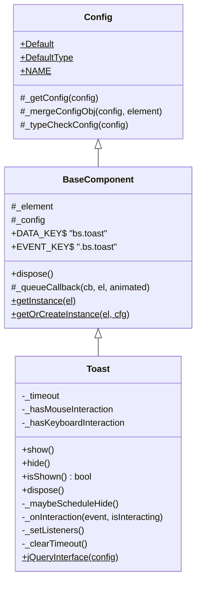
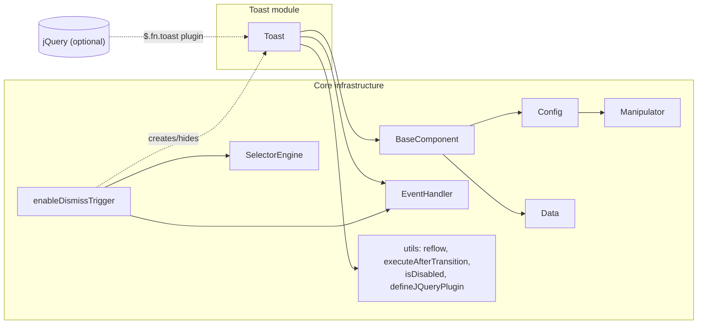
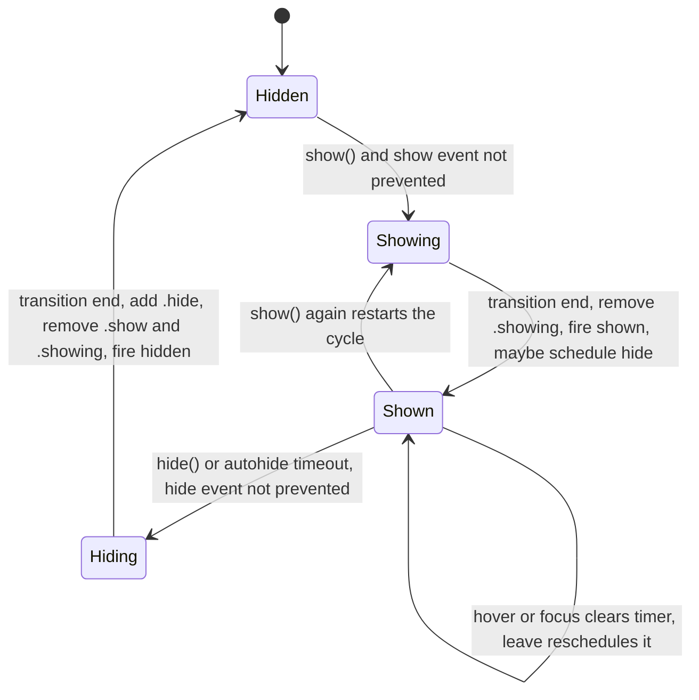
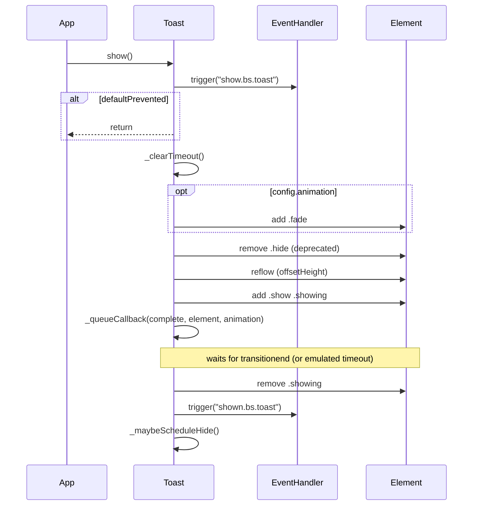
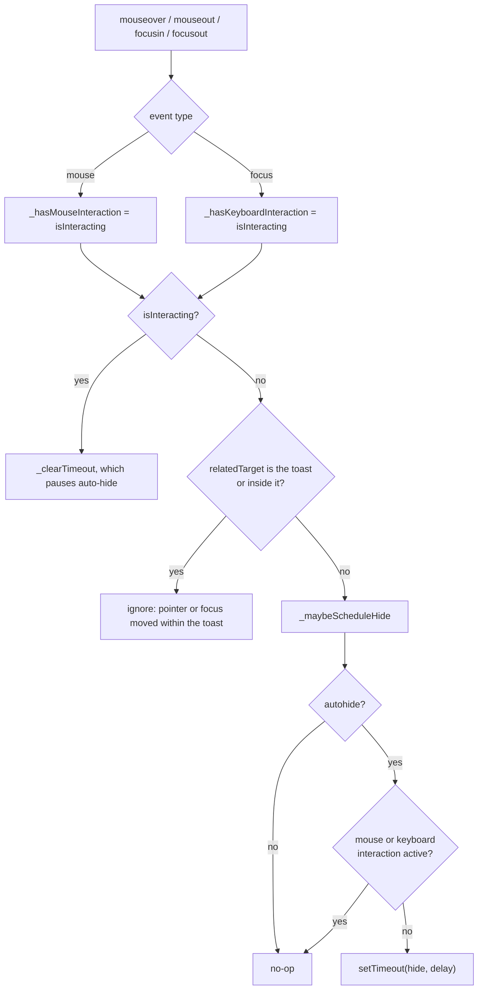

# Bootstrap Overlay Components – Toast

## Introduction

The **Toast** module covers the Bootstrap v5.3.3 `Toast` component that ships with the AgentsWebUI static assets (`0-Agents/AgentsWebUI/wwwroot/lib/bootstrap/dist/js/`). A toast is a small, non-blocking notification. It fades in, can hide itself after a delay, and pauses that auto-hide timer while the user hovers over it or moves focus into it.

Toast is the simplest member of the [overlay components](bootstrap_overlay_components.md) family:

- It has **no backdrop, no focus trap and no scroll locking**, unlike [Modal / Offcanvas](bootstrap_overlay_components_modal_dialogs.md).
- It uses **no Popper positioning**, unlike [Dropdown / Tooltip / Popover](bootstrap_overlay_components_popper_positioned.md). Where the toast appears on screen is left entirely to CSS (for example `.toast-container` with position utilities).
- Its only framework dependency is the shared base layer described in [bootstrap_core_infrastructure](bootstrap_core_infrastructure.md) (`BaseComponent`, `Config`, `EventHandler`, `Data`, `Manipulator`, `SelectorEngine` and the transition helpers).

The same `Toast` class appears in all three distribution builds. The code is identical in each; only the packaging differs:

| File | Format | Popper | Notes for Toast |
|------|--------|--------|-----------------|
| `bootstrap.bundle.js` | UMD (`window.bootstrap`) | Bundled inline | No difference, since Toast does not use Popper |
| `bootstrap.js` | UMD (`window.bootstrap`) | External `@popperjs/core` | Toast works even if Popper is not loaded |
| `bootstrap.esm.js` | ES module (`export { Toast, … }`) | `import * as Popper` | The ESM file still imports Popper at module level |

---

## Architecture



`Config` and `BaseComponent` are documented in [bootstrap_core_infrastructure](bootstrap_core_infrastructure.md). Toast inherits these behaviours from them:

- **Instance registry.** `Data` keeps one instance per element under the key `bs.toast`.
- **Config merge order.** `Default` → JSON in `data-bs-config` → individual `data-bs-*` attributes → the JS config object. The merged result is type-checked against `DefaultType`.
- **Transition handling.** `_queueCallback` runs the callback on `transitionend`, with a timeout fallback. If animation is disabled, the callback runs synchronously.
- **Cleanup.** `dispose()` removes the `Data` entry, unbinds every `.bs.toast` handler on the element and nulls the instance fields.

### Module dependencies



---

## Configuration

| Option | Type | Default | Data attribute | Description |
|--------|------|---------|----------------|-------------|
| `animation` | boolean | `true` | `data-bs-animation` | Adds the `.fade` class and waits for CSS transitions before firing `shown`/`hidden` |
| `autohide` | boolean | `true` | `data-bs-autohide` | Hides the toast automatically after `delay` ms |
| `delay` | number | `5000` | `data-bs-delay` | Auto-hide delay in milliseconds |

An invalid type, such as `delay: "abc"`, throws `TypeError: TOAST: Option "delay" provided type "string" but expected type "number".` Numeric data attributes are converted automatically by `Manipulator`'s `normalizeData`, so `data-bs-delay="3000"` passes the check.

## Public API

| Member | Description |
|--------|-------------|
| `new Toast(element, config?)` | Creates the instance and binds the hover/focus interaction listeners |
| `Toast.getInstance(el)` / `Toast.getOrCreateInstance(el, cfg)` | Registry helpers inherited from `BaseComponent` |
| `show()` | Reveals the toast. This method does **not** check whether the toast is already visible; calling it again restarts the animation cycle and the auto-hide timer |
| `hide()` | Hides the toast. Does nothing if the toast is not shown |
| `isShown()` | Returns `true` when the element has the `.show` class |
| `dispose()` | Clears the pending timer, removes `.show` and then runs the base cleanup |
| `Toast.VERSION` | `"5.3.3"` |

### Events

All events are dispatched on the toast element with the `.bs.toast` namespace.

| Event | Cancelable effect | When it fires |
|-------|-------------------|---------------|
| `show.bs.toast` | `preventDefault()` aborts `show()` | Immediately when `show()` is called |
| `shown.bs.toast` | – | After the show transition completes |
| `hide.bs.toast` | `preventDefault()` aborts `hide()` | Immediately when `hide()` is called on a shown toast |
| `hidden.bs.toast` | – | After the hide transition completes |

### CSS classes managed

| Class | Meaning |
|-------|---------|
| `fade` | Added on `show()` when `animation` is true. It is never removed by the component |
| `show` | Marks the toast as visible. This class is the source of truth for `isShown()` |
| `showing` | Transitional class present while the toast is fading in or out |
| `hide` | **Deprecated.** Removed on show and added after hiding, for backward compatibility only |

---

## Lifecycle



### `show()` sequence



### `hide()` sequence

`hide()` returns early unless `isShown()` is true. It then fires `hide.bs.toast`, which can be cancelled, and adds `.showing` so the CSS fade-out can run. When the transition ends, it adds `.hide`, removes `.showing` and `.show`, and fires `hidden.bs.toast`. The element stays in the DOM. Unlike `Alert`, a toast is never removed from the page.

---

## Auto-hide and interaction logic

Toast listens for `mouseover`, `mouseout`, `focusin` and `focusout` on its own element. These events bubble from children, which is why the component uses them instead of `mouseenter`/`mouseleave`. It tracks two independent flags:



Things to know about this logic:

- **Restarting, not resuming.** When the user leaves the toast, a fresh timer for the full `delay` starts. The time already elapsed is discarded.
- **Both flags must be clear.** If the mouse leaves while focus is still inside the toast, for example on its close button, the timer is not rescheduled. That keeps the toast visible for keyboard users.
- **No timer before `shown`.** `_maybeScheduleHide` is first called only in the `show()` completion callback.
- **`autohide: false`** turns scheduling off completely. The toast must then be closed through `hide()` or a dismiss button.

---

## Data API and integration points

### Dismiss trigger

`enableDismissTrigger(Toast)` registers a single delegated listener on `document`:

```
click.dismiss.bs.toast  on  [data-bs-dismiss="toast"]
```

When the listener runs, it:

1. Calls `preventDefault()` if the trigger is an `<a>` or `<area>`.
2. Ignores the click if the trigger is disabled (`isDisabled`).
3. Resolves the target from `data-bs-target`/`href`, or falls back to `closest('.toast')`.
4. Runs `Toast.getOrCreateInstance(target).hide()`.

> **Note:** there is **no data API for showing** toasts. Unlike Modal or Collapse, no `data-bs-toggle="toast"` exists. Toasts must be created and shown from JavaScript.

### jQuery bridge

When `window.jQuery` is present and `<body>` does not have `data-bs-no-jquery`, `defineJQueryPlugin` registers `$.fn.toast` after `DOMContentLoaded`:

```js
$('#myToast').toast({ delay: 3000 }); // create/configure
$('#myToast').toast('show');          // invoke method
```

`Toast.jQueryInterface` calls `data[config](this)` for any string it receives, and throws `TypeError: No method named "…"` only when that property is `undefined`. Unlike Alert, Carousel, Offcanvas and ScrollSpy, it does **not** reject names that begin with `_` or the name `constructor`. Only pass the public method names (`show`, `hide`, `dispose`, `isShown`).

---

## Usage in AgentsWebUI

Typical markup:

```html
<div class="toast-container position-fixed bottom-0 end-0 p-3">
  <div id="agentToast" class="toast" role="alert" aria-live="assertive" aria-atomic="true"
       data-bs-delay="4000">
    <div class="toast-header">
      <strong class="me-auto">Agent</strong>
      <button type="button" class="btn-close" data-bs-dismiss="toast" aria-label="Close"></button>
    </div>
    <div class="toast-body">Run completed.</div>
  </div>
</div>
```

```js
// UMD builds (bootstrap.js / bootstrap.bundle.js)
const toast = bootstrap.Toast.getOrCreateInstance('#agentToast', { autohide: true });
toast.show();

document.getElementById('agentToast')
  .addEventListener('hidden.bs.toast', () => console.log('toast closed'));

// ESM build
// import { Toast } from './lib/bootstrap/dist/js/bootstrap.esm.js';
```

### Practical notes

- **One component per element.** `Data.set` logs an error if a toast element already holds another Bootstrap component instance.
- **Positioning and stacking are CSS concerns.** Several toasts can be shown at once. Each has its own timer, and the component does no queueing.
- **Accessibility.** Toast does not manage ARIA attributes. Set `role="alert"`/`aria-live` or `role="status"` yourself.
- **Reusing a toast.** Call `show()` on the existing instance. The element stays in the DOM after hiding, so no re-creation is needed. Call `dispose()` only when the element is about to be removed.

## Related documentation

- [bootstrap_core_infrastructure](bootstrap_core_infrastructure.md): `BaseComponent`, `Config` and the shared helpers
- [bootstrap_overlay_components](bootstrap_overlay_components.md): overview of the overlay family
- [bootstrap_overlay_components_modal_dialogs](bootstrap_overlay_components_modal_dialogs.md): Modal and Offcanvas (backdrop and focus-trap based)
- [bootstrap_overlay_components_popper_positioned](bootstrap_overlay_components_popper_positioned.md): Dropdown, Tooltip and Popover
- [bootstrap_interactive_content_components](bootstrap_interactive_content_components.md): Alert (which shares the dismiss-trigger mechanism), Collapse, Carousel and others
