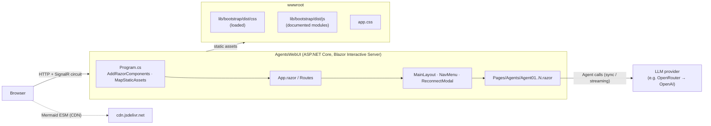
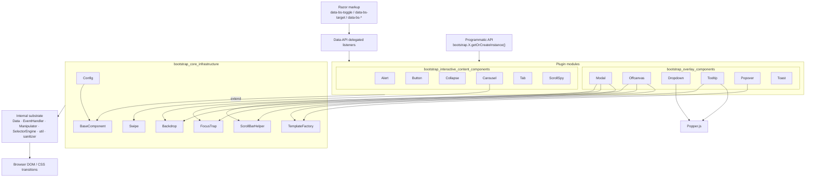
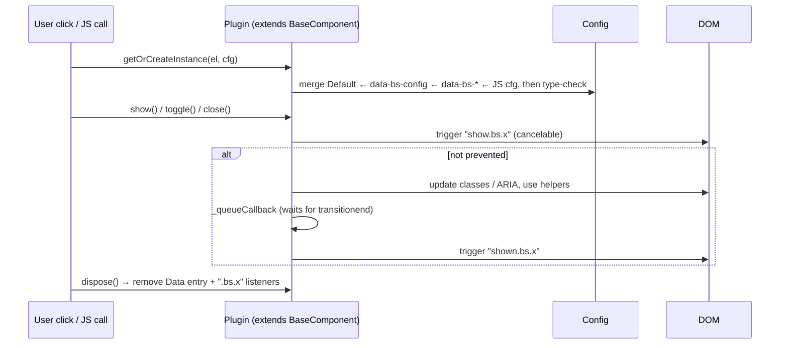

# agent-framework-sample: Repository Overview

## Purpose

`agent-framework-sample` is a set of AI-agent samples. You run them from a Blazor Server web app called **AgentsWebUI** (`0-Agents/AgentsWebUI`). Each sample page (`/agent01`, `/agent02`, …) shows one agent pattern. For example, *Agent 01 – Basic Agent* lets you edit the agent's instructions and message, then run it in normal (Submit) or streaming (Stream) mode against an OpenAI model through OpenRouter. Pages are styled with Bootstrap CSS, and Mermaid (loaded from a CDN) renders diagrams on the pages.

The modules documented in `docs/` cover the **Bootstrap v5.3.3 JavaScript library** copied into the app at `0-Agents/AgentsWebUI/wwwroot/lib/bootstrap/dist/js/`. This library adds client-side behaviour to `data-bs-*` markup, such as modals, dropdowns, tooltips, collapse and carousel. It ships in three builds with the same logic:

| File | Format | Popper.js |
|---|---|---|
| `bootstrap.bundle.js` | UMD (`window.bootstrap`) | Built in |
| `bootstrap.js` | UMD | External (`@popperjs/core` / `window.Popper`) |
| `bootstrap.esm.js` | ES module | External (`import * as Popper`) |

> **Note:** `Components/App.razor` currently loads only `bootstrap.min.css` and `blazor.web.js`. No Razor, C# or HTML file references any of the Bootstrap JS builds. The JS plugins described below are available in `wwwroot` but are not active in the app until a `<script>` tag (usually for `bootstrap.bundle.js`) is added.

## End-to-end Architecture

### Application runtime

### Bootstrap JS module layering

### Component lifecycle (shared by all plugins)

## Core Modules

| Module | Scope | Documentation |
|---|---|---|
| **bootstrap_core_infrastructure** | `Config` and `BaseComponent` base classes, plus the helpers `Backdrop`, `FocusTrap`, `ScrollBarHelper`, `Swipe` and `TemplateFactory` (HTML sanitization). Also covers config merge order, the one-instance-per-element rule, and the jQuery bridge. | [bootstrap_core_infrastructure.md](bootstrap_core_infrastructure.md) |
| **bootstrap_overlay_components** | Components that float over the page: Modal, Offcanvas, Dropdown, Tooltip, Popover and Toast. | [bootstrap_overlay_components.md](bootstrap_overlay_components.md) |
| ↳ modal dialogs | Modal and Offcanvas: backdrop, focus trap, scroll lock, static backdrop | [bootstrap_overlay_components_modal_dialogs.md](bootstrap_overlay_components_modal_dialogs.md) |
| ↳ popper positioned | Dropdown, Tooltip and Popover: Popper placement, triggers, sanitized templates | [bootstrap_overlay_components_popper_positioned.md](bootstrap_overlay_components_popper_positioned.md) |
| ↳ toast | Toast: notifications that hide automatically and pause on hover or focus | [bootstrap_overlay_components_toast.md](bootstrap_overlay_components_toast.md) |
| **bootstrap_interactive_content_components** | Widgets that change content already on the page: Alert, Button, Collapse/accordion, Carousel, Tab and ScrollSpy (uses IntersectionObserver). | [bootstrap_interactive_content_components.md](bootstrap_interactive_content_components.md) |

## Key Operational Notes

- **Popper:** use `bootstrap.bundle.js` unless Popper is loaded separately. Otherwise Dropdown and Tooltip throw an error saying they require Popper.
- **Declarative vs. programmatic use:** most plugins start automatically from `data-bs-*` attributes. Tooltip and Popover must be created in JavaScript.
- **Blazor interop:** Blazor re-renders parts of the page, so plugin instances attached to elements it replaces may need `dispose()` and to be recreated.
- **Security:** `TemplateFactory` sanitizes Tooltip and Popover HTML against an allowlist. Tooltip also ignores `sanitize`, `allowList` and `sanitizeFn` when they are set through `data-bs-*` attributes, so page markup can't turn sanitization off.