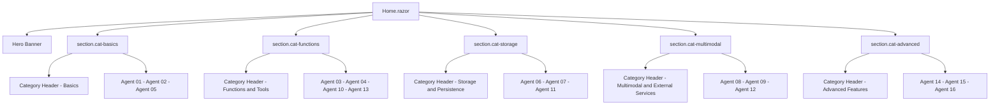

# Home Page UI Redesign — Design Specification

## Project Context Summary

| Item | Detail |
|---|---|
| Framework | Blazor Web Application (.NET 10), Interactive Server render mode |
| CSS Framework | Bootstrap 5 (loaded from `lib/bootstrap/dist/css/bootstrap.min.css` via `App.razor`) |
| Icon Libraries | **None available** — only Bootstrap CSS is present; no Bootstrap Icons CDN, no Font Awesome |
| Sidebar gradient | `linear-gradient(180deg, rgb(5, 39, 103) 0%, #3a0647 70%)` (deep navy → deep purple) |
| Primary brand color | `#1b6ec2` (btn-primary background), `#006bb7` (links) |
| Content area | Right of a 250px fixed sidebar; `article.content` with `padding-top: 1.1rem` |
| Scoped CSS file | A new `Home.razor.css` is permitted (scoped to the component) |

---

## 1. Findings — Current Weaknesses

1. **No visual hierarchy** — a flat `<h1>` followed immediately by a 16-card grid.
2. **No categorisation** — all 16 agents look identical; users cannot scan them by topic.
3. **Uniform card style** — same border, same padding, no colour accent, no badge/tag.
4. **Generic hero** — plain text, no sub-title, no tech-stack badges.
5. **No hover feedback** — cards are static with only a button that has default Blazor Bootstrap style.
6. **No icon/visual indicator** — every card title starts with "Agent NN –" making scanning harder.
7. **"Go to Agent N" CTA** — unnumbered labels are more useful than ordinal ones.

---

## 2. Icon Strategy

Because **no icon library is installed**, icons will be implemented using **Unicode emoji characters** or **inline SVG data-URI background images via scoped CSS**, consistent with how the existing [`NavMenu.razor.css`](../0-Agents/AgentsWebUI/Components/Layout/NavMenu.razor.css:37) already uses `background-image` SVG data-URIs for its `.bi-*` icon classes.

Each category will receive a coloured **category icon** defined as a `<span>` with a short Unicode emoji rendered at `1.25rem`. Card-level badges will use Bootstrap `badge` classes with custom scoped background colours.

This approach requires **zero new CDN links** and is self-contained.

---

## 3. Agent Category Assignments

The 16 agents are grouped into 5 thematic categories. The groupings mirror the sidebar labels already in [`NavMenu.razor`](../0-Agents/AgentsWebUI/Components/Layout/NavMenu.razor:1).

### Category 1 — Basics
**Colour theme:** Blue (`#0d6efd` — Bootstrap `primary`)  
**Emoji icon:** 🚀

| # | Short Title | Badge Label | Navigation |
|---|---|---|---|
| 01 | Basic Agent | `Basic` | `/agent01` |
| 02 | Agent with Thread | `Thread` | `/agent02` |
| 05 | Structured Output | `Structured` | `/agent05` |

**Rationale:** Agents 01, 02, and 05 are the purest introductory concepts — create an agent, add memory/threads, shape its output. Agent 05 sits here rather than in "Functions" because structured output is a model capability, not a tool-calling feature.

---

### Category 2 — Functions & Tools
**Colour theme:** Green (`#198754` — Bootstrap `success`)  
**Emoji icon:** 🔧

| # | Short Title | Badge Label | Navigation |
|---|---|---|---|
| 03 | Agent with Function/Tool | `Function` | `/agent03` |
| 04 | Functions with User Approval | `Approval` | `/agent04` |
| 10 | Agent as Function | `Agent Tool` | `/agent10` |
| 13 | Plugins | `Plugins` | `/agent13` |

**Rationale:** These 4 all revolve around extending an agent's capability by calling external code (functions, plugins, or another agent used as a tool).

---

### Category 3 — Storage & Persistence
**Colour theme:** Teal (`#0dcaf0` — Bootstrap `info`, darkened to `#087990` for text contrast)  
**Emoji icon:** 💾

| # | Short Title | Badge Label | Navigation |
|---|---|---|---|
| 06 | Persisted Conversation | `Persistence` | `/agent06` |
| 07 | Custom Thread Storage | `Vector Store` | `/agent07` |
| 11 | Chat Reduction | `Reduction` | `/agent11` |

**Rationale:** Agents 06, 07, and 11 are all about how conversation history is managed, stored, truncated, or restored.

---

### Category 4 — Multimodal & External Services
**Colour theme:** Purple (`#6f42c1` — Bootstrap `$purple`)  
**Emoji icon:** 🌐

| # | Short Title | Badge Label | Navigation |
|---|---|---|---|
| 08 | Agent Using Image | `Multimodal` | `/agent08` |
| 09 | Using Remote MCP Server | `MCP` | `/agent09` |
| 12 | Background Responses | `Async` | `/agent12` |

**Rationale:** Agents 08 and 09 explicitly consume content beyond plain text (images, MCP tool servers). Agent 12 is grouped here because it uses a background/async processing pattern that resembles calling an external service asynchronously.

---

### Category 5 — Advanced Features
**Colour theme:** Orange (`#fd7e14` — Bootstrap `$orange`)  
**Emoji icon:** ⚡

| # | Short Title | Badge Label | Navigation |
|---|---|---|---|
| 14 | Middleware | `Middleware` | `/agent14` |
| 15 | Declarative Agent | `Declarative` | `/agent15` |
| 16 | Reasoning | `Reasoning` | `/agent16` |

**Rationale:** These represent the most sophisticated patterns (pipeline interception, YAML-defined agents, advanced model reasoning).

---

## 4. Hero Section Design

```
┌──────────────────────────────────────────────────────┐
│  [gradient bg: navy → ms-blue]                       │
│                                                      │
│  🤖  Microsoft Agent Framework Samples               │
│      Explore 16 interactive samples built with       │
│      the Microsoft Agent Framework on .NET 10.       │
│                                                      │
│  [ .NET 10 ]  [ Blazor ]  [ OpenAI ]  [ MCP ]        │
│                                                      │
└──────────────────────────────────────────────────────┘
```

### Hero HTML Structure (inside `Home.razor`)

```html
<div class="hero-banner rounded-3 mb-5 px-4 py-5 text-white"
     style="background: linear-gradient(135deg, #052767 0%, #1b6ec2 60%, #3a0647 100%);">
    <div class="d-flex align-items-center gap-3 mb-2">
        <span style="font-size:2.5rem;" aria-hidden="true">🤖</span>
        <h1 class="display-5 fw-bold mb-0">Microsoft Agent Framework Samples</h1>
    </div>
    <p class="lead mb-4" style="max-width:680px; opacity:.9;">
        Explore 16 interactive samples that demonstrate the capabilities of the
        <strong>Microsoft Agent Framework</strong> in a Blazor Web Application on .NET 10.
    </p>
    <div class="d-flex flex-wrap gap-2">
        <span class="badge rounded-pill px-3 py-2" style="background:rgba(255,255,255,.2);font-size:.85rem;">.NET 10</span>
        <span class="badge rounded-pill px-3 py-2" style="background:rgba(255,255,255,.2);font-size:.85rem;">Blazor</span>
        <span class="badge rounded-pill px-3 py-2" style="background:rgba(255,255,255,.2);font-size:.85rem;">OpenAI</span>
        <span class="badge rounded-pill px-3 py-2" style="background:rgba(255,255,255,.2);font-size:.85rem;">MCP</span>
        <span class="badge rounded-pill px-3 py-2" style="background:rgba(255,255,255,.2);font-size:.85rem;">Semantic Kernel</span>
    </div>
</div>
```

**Design decisions:**
- The gradient reuses the sidebar palette (`#052767` navy, `#1b6ec2` brand primary and `#3a0647` sidebar purple) so the hero feels connected to the navigation chrome.
- `rounded-3` softens the rectangular block to match Bootstrap's card rounding.
- Semi-transparent pill badges don't need new colour classes; `rgba(255,255,255,.2)` works on any dark gradient.
- `max-width:680px` on the lead paragraph keeps it readable on wide viewports.

---

## 5. Category Section Header Design

Each of the 5 categories is rendered as a `<section>` with a sticky-free header row:

```html
<section class="agent-category mb-5">
    <div class="category-header d-flex align-items-center gap-2 mb-3 pb-2">
        <span class="category-icon" aria-hidden="true">🚀</span>
        <h2 class="h4 mb-0 fw-semibold">Basics</h2>
        <span class="badge ms-2" style="background:#0d6efd;">3 samples</span>
    </div>
    <div class="row g-3">
        <!-- cards here -->
    </div>
</section>
```

The `.category-header` will have a scoped CSS rule adding a bottom border using the category accent colour (see §8).

---

## 6. Individual Card Design

Each card gets:
1. A **colour-coded top accent border** (`border-top: 4px solid <category-colour>`) replacing the uniform Bootstrap border.
2. A **badge** in the upper-right of `card-body` showing the short tag.
3. A **short display title** (without the "Agent NN –" prefix) in `card-title`.
4. The `card-text` description is preserved verbatim.
5. The `card-footer` button text changes from "Go to Agent N" to **"Explore Sample →"** (consistent across all cards). The number/identity is already encoded in the card title.
6. A **hover lift** effect: `transform: translateY(-4px); box-shadow: 0 8px 24px rgba(0,0,0,.12)` via scoped CSS transition.

### Card HTML template

```html
<div class="col-md-4 col-sm-6">
    <div class="card h-100 agent-card">
        <div class="card-body">
            <div class="d-flex justify-content-between align-items-start mb-2">
                <h5 class="card-title mb-0">Basic Agent</h5>
                <span class="badge agent-badge-basics">Basic</span>
            </div>
            <p class="card-text text-muted small">
                Demonstrates the basic functionality of creating and running an agent.
                Shows both a simple request/response and a streaming response.
            </p>
        </div>
        <div class="card-footer bg-transparent border-0 pt-0">
            <a href="/agent01" class="btn btn-primary btn-sm w-100">Explore Sample →</a>
        </div>
    </div>
</div>
```

**Design decisions:**
- `col-sm-6` added so cards become 2-column on tablets (Bootstrap `sm` = 576px) rather than full-width, improving layout density on iPads.
- `g-3` gutter on the row provides consistent 16px spacing without `mb-4` on every col.
- `card-footer bg-transparent border-0 pt-0` removes the default grey footer band; the CTA button is inset flush with the card body.
- `btn-sm w-100` makes the CTA full-width inside the card footer, giving a consistent call-to-action target.
- Trimmed `card-text` descriptions for cards whose originals are very long (see §7 for exact trimmed text).

---

## 7. Complete Card Content Inventory

All 16 cards with their final short title, badge, trimmed description, and link.

> **Note on description trimming:** The original descriptions are well-written; the goal is brevity for the card format (2–3 sentences max). Full descriptions can remain in Agent pages.

| # | Display Title | Badge | Trimmed Description | Category | Link |
|---|---|---|---|---|---|
| 01 | Basic Agent | `Basic` | Demonstrates the basic functionality of creating and running an agent. Shows both a simple request/response and a streaming response. | Basics | `/agent01` |
| 02 | Agent with Thread | `Thread` | Showcases how to use threads for multi-turn conversations. The agent remembers the context of previous messages in the same thread. | Basics | `/agent02` |
| 03 | Agent with Function/Tool | `Function` | Demonstrates how to provide functions (tools) to an agent. Uses `Add` and `Multiply` functions to solve a math problem the model cannot reason numerically. | Functions & Tools | `/agent03` |
| 04 | Functions with User Approval | `Approval` | Adds a user approval step before any function is executed. The agent asks for confirmation before calling `Add` or `Multiply`. | Functions & Tools | `/agent04` |
| 05 | Structured Output | `Structured` | Shows how to extract structured data (JSON) from unstructured text. The agent populates a `PersonInfo` object from natural language. | Basics | `/agent05` |
| 06 | Persisted Conversation | `Persistence` | Demonstrates serializing a conversation thread to disk and resuming it in a later interaction. | Storage & Persistence | `/agent06` |
| 07 | Custom Thread Storage | `Vector Store` | Uses a custom `VectorChatMessageStore` to persist conversation history in memory, enabling scalable and searchable thread storage. | Storage & Persistence | `/agent07` |
| 08 | Agent Using Image | `Multimodal` | Demonstrates how a multimodal model analyzes an image. Accepts an image URL and text prompt, returns a description of the image content. | Multimodal & External | `/agent08` |
| 09 | Using Remote MCP Server | `MCP` | Connects to the Microsoft Learn MCP server to answer questions about Microsoft technologies using the server's tools. | Multimodal & External | `/agent09` |
| 10 | Agent as Function | `Agent Tool` | Demonstrates using one agent as a callable tool for another. A `weatherAgent` serves as a function that a parent agent invokes for language-specific responses. | Functions & Tools | `/agent10` |
| 11 | Chat Reduction | `Reduction` | Demonstrates chat reduction techniques using message store reducers to limit conversation context to essential exchanges. | Storage & Persistence | `/agent11` |
| 12 | Background Responses | `Async` | Illustrates asynchronous background responses, enabling long processing times with response resumption and continuous streaming. | Multimodal & External | `/agent12` |
| 13 | Plugins | `Plugins` | Showcases plugin integration to add external services (weather, current time) via dependency injection. | Functions & Tools | `/agent13` |
| 14 | Middleware | `Middleware` | Demonstrates middleware for logging, function overriding, and content redaction to enforce safety and custom pipeline behaviors. | Advanced Features | `/agent14` |
| 15 | Declarative Agent | `Declarative` | Configures an agent via a YAML definition with an output schema, returning responses in structured JSON format. | Advanced Features | `/agent15` |
| 16 | Reasoning | `Reasoning` | Demonstrates advanced reasoning with OpenAI's `o4-mini` model, exposing both the final answer and step-by-step reasoning. | Advanced Features | `/agent16` |

---

## 8. Scoped CSS — `Home.razor.css`

All rules below live in a new file `0-Agents/AgentsWebUI/Components/Pages/Home.razor.css`. Blazor's CSS isolation will scope them automatically.

```css
/* ──────────────────────────────────────────
   Agent card base
────────────────────────────────────────── */
.agent-card {
    transition: transform 0.18s ease, box-shadow 0.18s ease;
    border-top-width: 4px;
    border-top-style: solid;
}

.agent-card:hover {
    transform: translateY(-4px);
    box-shadow: 0 8px 24px rgba(0, 0, 0, 0.12);
}

/* ──────────────────────────────────────────
   Category colour themes
   Applied via a wrapper class on the card
────────────────────────────────────────── */

/* Basics — Bootstrap primary blue */
.cat-basics .agent-card   { border-top-color: #0d6efd; }
.cat-basics .agent-badge  { background-color: #0d6efd; color: #fff; }

/* Functions & Tools — Bootstrap success green */
.cat-functions .agent-card  { border-top-color: #198754; }
.cat-functions .agent-badge { background-color: #198754; color: #fff; }

/* Storage & Persistence — Bootstrap info teal */
.cat-storage .agent-card  { border-top-color: #087990; }
.cat-storage .agent-badge { background-color: #087990; color: #fff; }

/* Multimodal & External — Bootstrap purple */
.cat-multimodal .agent-card  { border-top-color: #6f42c1; }
.cat-multimodal .agent-badge { background-color: #6f42c1; color: #fff; }

/* Advanced Features — Bootstrap orange */
.cat-advanced .agent-card  { border-top-color: #fd7e14; }
.cat-advanced .agent-badge { background-color: #fd7e14; color: #fff; }

/* ──────────────────────────────────────────
   Category section header underline
────────────────────────────────────────── */
.cat-basics    .category-header  { border-bottom: 2px solid #0d6efd; }
.cat-functions .category-header  { border-bottom: 2px solid #198754; }
.cat-storage   .category-header  { border-bottom: 2px solid #087990; }
.cat-multimodal .category-header { border-bottom: 2px solid #6f42c1; }
.cat-advanced   .category-header { border-bottom: 2px solid #fd7e14; }

/* ──────────────────────────────────────────
   Category badge count pill
────────────────────────────────────────── */
.cat-basics    .cat-count-badge { background-color: #0d6efd; }
.cat-functions .cat-count-badge { background-color: #198754; }
.cat-storage   .cat-count-badge { background-color: #087990; }
.cat-multimodal .cat-count-badge { background-color: #6f42c1; }
.cat-advanced   .cat-count-badge { background-color: #fd7e14; }
```

### How category classes are applied

Each `<section>` wrapping a category group receives the relevant category class:

```html
<section class="agent-category cat-basics mb-5">
    <div class="category-header ...">...</div>
    <div class="row g-3">
        <div class="col-md-4 col-sm-6">
            <div class="card h-100 agent-card">
                ...
                <span class="badge agent-badge">Basic</span>
                ...
            </div>
        </div>
    </div>
</section>
```

Because the category colour class (e.g., `cat-basics`) is on the `<section>` ancestor, the descendant CSS selectors (`.cat-basics .agent-card`, `.cat-basics .agent-badge`) apply automatically — no per-card inline colour styles are needed.

---

## 9. Full Home.razor Structure (Pseudocode / Skeleton)

```
@page "/"
<PageTitle>Home</PageTitle>

<!-- Hero Banner -->
<div class="hero-banner rounded-3 mb-5 px-4 py-5 text-white" style="...gradient...">
    <h1>Microsoft Agent Framework Samples</h1>
    <p class="lead">...</p>
    <!-- Tech stack pill badges -->
</div>

<!-- Category 1: Basics -->
<section class="agent-category cat-basics mb-5">
    <div class="category-header d-flex align-items-center gap-2 mb-3 pb-2">
        <span>🚀</span>
        <h2 class="h4 mb-0 fw-semibold">Basics</h2>
        <span class="badge cat-count-badge ms-2">3 samples</span>
    </div>
    <div class="row g-3">
        <!-- Agent 01, 02, 05 cards -->
    </div>
</section>

<!-- Category 2: Functions & Tools -->
<section class="agent-category cat-functions mb-5">
    <!-- 🔧 Functions & Tools header -->
    <div class="row g-3">
        <!-- Agent 03, 04, 10, 13 cards -->
    </div>
</section>

<!-- Category 3: Storage & Persistence -->
<section class="agent-category cat-storage mb-5">
    <!-- 💾 Storage & Persistence header -->
    <div class="row g-3">
        <!-- Agent 06, 07, 11 cards -->
    </div>
</section>

<!-- Category 4: Multimodal & External Services -->
<section class="agent-category cat-multimodal mb-5">
    <!-- 🌐 Multimodal & External Services header -->
    <div class="row g-3">
        <!-- Agent 08, 09, 12 cards -->
    </div>
</section>

<!-- Category 5: Advanced Features -->
<section class="agent-category cat-advanced mb-5">
    <!-- ⚡ Advanced Features header -->
    <div class="row g-3">
        <!-- Agent 14, 15, 16 cards -->
    </div>
</section>
```

---

## 10. Layout & Responsiveness

| Breakpoint | Card columns | Notes |
|---|---|---|
| `< 576px` (xs) | 1 column (`col-12` default) | Full-width stacked list |
| `≥ 576px` (sm) | 2 columns (`col-sm-6`) | Fits phone landscape / small tablet |
| `≥ 768px` (md) | 3 columns (`col-md-4`) | Target desktop layout |

The outer container uses `class="container"` (no `-fluid`) matching the existing [`Home.razor`](../0-Agents/AgentsWebUI/Components/Pages/Home.razor:5) convention, capped at Bootstrap's default max-width per breakpoint.

---

## 11. Overall Page Architecture Diagram



---

## 12. Files to Create / Modify

| File | Action | Notes |
|---|---|---|
| [`Home.razor`](../0-Agents/AgentsWebUI/Components/Pages/Home.razor) | **Modify** | Replace entire file content per §9 skeleton, using §7 card inventory |
| [`Home.razor.css`](../0-Agents/AgentsWebUI/Components/Pages/Home.razor.css) | **Create new** | All scoped rules from §8 |

No other files need changes. No CDN links need to be added to [`App.razor`](../0-Agents/AgentsWebUI/Components/App.razor).

---

## 13. Implementation Checklist for Code Mode

- [ ] Create `Home.razor.css` in `0-Agents/AgentsWebUI/Components/Pages/` with all rules from §8
- [ ] Replace `Home.razor` with new implementation:
  - [ ] Hero banner section with gradient, heading, subtitle, tech-stack pill badges
  - [ ] 5 `<section>` blocks, one per category, each with the appropriate `cat-*` class
  - [ ] Category headers (emoji icon, h2, count badge)
  - [ ] All 16 agent cards using the structure in §6, with short titles from §7, trimmed descriptions, and `Explore Sample →` CTA
  - [ ] Outer container (`class="container"`) preserved
  - [ ] Card columns: `col-md-4 col-sm-6` on each card wrapper
  - [ ] "Background Responses" typo fix (Agent 12 was "Backgroud" in the original)
  - [ ] "Declarative Agent" typo fix (Agent 15 was "Declartive" in the original)
