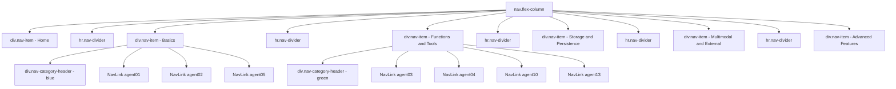

# NavMenu.razor Redesign Specification

## Overview

This document provides a complete, unambiguous specification for redesigning [`NavMenu.razor`](../0-Agents/AgentsWebUI/Components/Layout/NavMenu.razor) and its companion stylesheet [`NavMenu.razor.css`](../0-Agents/AgentsWebUI/Components/Layout/NavMenu.razor.css). The redesign aligns the sidebar navigation with the 5-category structure already implemented on [`Home.razor`](../0-Agents/AgentsWebUI/Components/Pages/Home.razor).

---

## Goals

| # | Goal |
|---|------|
| 1 | Replace generic brand name with a friendlier, emoji-accented label |
| 2 | Replace the flat 16-item list with 5 grouped category sections |
| 3 | Add non-clickable category header labels with colour accents |
| 4 | Fix two typos (Agent 12, Agent 15) |
| 5 | Remove redundant `bi-plus-square-fill-nav-menu` icons from agent links |
| 6 | Keep all existing mobile-toggle behaviour intact |
| 7 | Add minimal, non-conflicting CSS to support new structural elements |

---

## Category Reference

The following table is the canonical mapping used throughout this spec. Colours must match the home page exactly.

| Category Key | Label Text | Emoji | Colour Hex | Agents (href → display name) |
|---|---|---|---|---|
| `basics` | BASICS | 🚀 | `#0d6efd` | agent01 → Basic · agent02 → Threads · agent05 → Structured Output |
| `functions` | FUNCTIONS & TOOLS | 🔧 | `#198754` | agent03 → Functions/Tools · agent04 → Function Approval · agent10 → Agent as Function · agent13 → Plugins |
| `storage` | STORAGE & PERSISTENCE | 💾 | `#087990` | agent06 → Persisted Conversation · agent07 → Custom Thread Storage · agent11 → Chat Reduction |
| `multimodal` | MULTIMODAL & EXTERNAL | 🌐 | `#6f42c1` | agent08 → Using Image · agent09 → Using MCP Server · agent12 → Background Responses |
| `advanced` | ADVANCED FEATURES | ⚡ | `#fd7e14` | agent14 → Middleware · agent15 → Declarative Agent · agent16 → Reasoning |

> **Typo fixes included above**: Agent 12 "Backgroud" → "Background Responses"; Agent 15 "Declartive" → "Declarative Agent".

---

## Structural Design

### High-Level Visual Layout

```
┌─────────────────────────────┐
│ 🤖 Agent Samples            │  ← .top-row / .navbar-brand
├─────────────────────────────┤
│ 🏠 Home                     │  ← single nav-item, unchanged
├─────────────────────────────┤
│ · · · · · · · · · · · · · · │  ← thin divider (hr.nav-divider)
│ 🚀 BASICS            [blue] │  ← .nav-category-header
│   Basic                     │  ← plain nav-link, no icon
│   Threads                   │
│   Structured Output         │
│ · · · · · · · · · · · · · · │  ← hr.nav-divider (between groups)
│ 🔧 FUNCTIONS & TOOLS [green]│
│   Functions/Tools           │
│   Function Approval         │
│   Agent as Function         │
│   Plugins                   │
│ · · · · · · · · · · · · · · │
│ 💾 STORAGE & PERSIST [teal] │
│   Persisted Conversation    │
│   Custom Thread Storage     │
│   Chat Reduction            │
│ · · · · · · · · · · · · · · │
│ 🌐 MULTIMODAL & EXT [purple]│
│   Using Image               │
│   Using MCP Server          │
│   Background Responses      │
│ · · · · · · · · · · · · · · │
│ ⚡ ADVANCED FEATURES [orange]│
│   Middleware                │
│   Declarative Agent         │
│   Reasoning                 │
└─────────────────────────────┘
```

---

## NavMenu.razor — Complete Replacement Markup

The entire file content is specified below. Every line is intentional; the developer should replace the file verbatim.

```razor
<div class="top-row ps-3 navbar navbar-dark">
    <div class="container-fluid">
        <a class="navbar-brand" href="">🤖 Agent Samples</a>
    </div>
</div>

<input type="checkbox" title="Navigation menu" class="navbar-toggler" />

<div class="nav-scrollable" onclick="document.querySelector('.navbar-toggler').click()">
    <nav class="nav flex-column">

        {{!-- Home --}}
        <div class="nav-item px-3">
            <NavLink class="nav-link" href="" Match="NavLinkMatch.All">
                <span class="bi bi-house-door-fill-nav-menu" aria-hidden="true"></span> Home
            </NavLink>
        </div>

        <hr class="nav-divider" />

        {{!-- 🚀 Basics --}}
        <div class="nav-item px-3">
            <div class="nav-category-header" style="color: #0d6efd;">🚀 BASICS</div>
            <NavLink class="nav-link" href="agent01">Basic</NavLink>
            <NavLink class="nav-link" href="agent02">Threads</NavLink>
            <NavLink class="nav-link" href="agent05">Structured Output</NavLink>
        </div>

        <hr class="nav-divider" />

        {{!-- 🔧 Functions & Tools --}}
        <div class="nav-item px-3">
            <div class="nav-category-header" style="color: #198754;">🔧 FUNCTIONS &amp; TOOLS</div>
            <NavLink class="nav-link" href="agent03">Functions/Tools</NavLink>
            <NavLink class="nav-link" href="agent04">Function Approval</NavLink>
            <NavLink class="nav-link" href="agent10">Agent as Function</NavLink>
            <NavLink class="nav-link" href="agent13">Plugins</NavLink>
        </div>

        <hr class="nav-divider" />

        {{!-- 💾 Storage & Persistence --}}
        <div class="nav-item px-3">
            <div class="nav-category-header" style="color: #087990;">💾 STORAGE &amp; PERSISTENCE</div>
            <NavLink class="nav-link" href="agent06">Persisted Conversation</NavLink>
            <NavLink class="nav-link" href="agent07">Custom Thread Storage</NavLink>
            <NavLink class="nav-link" href="agent11">Chat Reduction</NavLink>
        </div>

        <hr class="nav-divider" />

        {{!-- 🌐 Multimodal & External --}}
        <div class="nav-item px-3">
            <div class="nav-category-header" style="color: #6f42c1;">🌐 MULTIMODAL &amp; EXTERNAL</div>
            <NavLink class="nav-link" href="agent08">Using Image</NavLink>
            <NavLink class="nav-link" href="agent09">Using MCP Server</NavLink>
            <NavLink class="nav-link" href="agent12">Background Responses</NavLink>
        </div>

        <hr class="nav-divider" />

        {{!-- ⚡ Advanced Features --}}
        <div class="nav-item px-3">
            <div class="nav-category-header" style="color: #fd7e14;">⚡ ADVANCED FEATURES</div>
            <NavLink class="nav-link" href="agent14">Middleware</NavLink>
            <NavLink class="nav-link" href="agent15">Declarative Agent</NavLink>
            <NavLink class="nav-link" href="agent16">Reasoning</NavLink>
        </div>

    </nav>
</div>
```

### Notes on the Markup

| Decision | Rationale |
|---|---|
| `{{!-- … --}}` comments | These are Razor comments (`@* *@` in actual Razor); shown here as `{{}}` for readability in the spec. Replace with `@* *@` in the actual file. |
| `&amp;` for `&` | HTML entity in static text inside a Razor component avoids any potential encoding ambiguity. |
| `hr.nav-divider` | A semantic horizontal rule styled to be subtle. Placed **between** groups, not inside `.nav-item`, so `:first-of-type` / `:last-of-type` selectors on `.nav-item` still work correctly. |
| No icon `<span>` on agent links | The `bi-plus-square-fill-nav-menu` icon added no semantic value. Removing it gives cleaner text-only links that are easier to scan. The Home link retains its house icon (existing behaviour). |
| Inline `style="color: …"` on `.nav-category-header` | Avoids creating 5 new CSS classes. One shared `.nav-category-header` class handles layout/typography; the colour varies per group via inline style. This is the minimal-CSS approach required. |
| Agent links within same `.nav-item` block as header | Keeps each category as one logical `.nav-item px-3` block. The existing `padding-bottom: 0.5rem` on `.nav-item` provides spacing below each group. |

---

## NavMenu.razor.css — Additions Only

The following CSS rules must be **appended** to the end of the existing [`NavMenu.razor.css`](../0-Agents/AgentsWebUI/Components/Layout/NavMenu.razor.css) file. No existing rules should be modified.

```css
/* ─── NavMenu Category Headers ─────────────────────────────────────────── */

.nav-category-header {
    font-size: 0.7rem;
    font-weight: 700;
    letter-spacing: 0.08em;
    text-transform: uppercase;
    padding: 0.5rem 0 0.25rem 0;
    /* colour is set inline per category */
    pointer-events: none;
    user-select: none;
}

/* ─── Divider between nav groups ────────────────────────────────────────── */

.nav-divider {
    border: none;
    border-top: 1px solid rgba(255, 255, 255, 0.1);
    margin: 0.15rem 1rem;
}
```

### CSS Design Decisions

| Property | Value | Reason |
|---|---|---|
| `font-size: 0.7rem` | Slightly smaller than the `0.9rem` of `.nav-item` | Creates clear visual hierarchy: header < link |
| `font-weight: 700` | Bold | Makes the uppercase label legible at small size |
| `letter-spacing: 0.08em` | Slight tracking | Standard typographic treatment for small-caps/uppercase labels |
| `text-transform: uppercase` | All caps | Matches the convention used in the home page category cards |
| `pointer-events: none` | Non-clickable | Category headers are purely decorative separators |
| `user-select: none` | Non-selectable | Prevents accidental text selection on header labels |
| `.nav-divider` border colour | `rgba(255,255,255,0.1)` | Matches the existing `border` colour used on `.navbar-toggler`, staying consistent with the dark sidebar palette |
| `.nav-divider` margin | `0 1rem` | Indents divider slightly from sidebar edges for a refined look |

---

## Preserved Behaviour Checklist

The following existing behaviours must not be broken by this change:

| Behaviour | How it is preserved |
|---|---|
| Mobile hamburger toggle | `<input class="navbar-toggler">` and `onclick="document.querySelector('.navbar-toggler').click()"` are unchanged |
| Active link highlight (`rgba(255,255,255,0.37)` background) | All agent links use `<NavLink class="nav-link">` — the `.nav-item ::deep a.active` rule still applies |
| Hover highlight | Same as above — `.nav-item ::deep .nav-link:hover` still applies |
| Scrollable sidebar on tall viewports | `.nav-scrollable` wrapper and its `overflow-y: auto` media query rule are untouched |
| `nav-item:first-of-type` top padding | The Home `div.nav-item` is still the first `.nav-item` in the `<nav>` |
| `nav-item:last-of-type` bottom padding | The Advanced Features `div.nav-item` is still the last `.nav-item` |
| No external CDN dependencies | Only Unicode emoji and one shared CSS class; no new scripts or stylesheets |

---

## Mermaid Component Diagram



---

## Files to Change

| File | Change Type | Summary |
|---|---|---|
| [`NavMenu.razor`](../0-Agents/AgentsWebUI/Components/Layout/NavMenu.razor) | Full replacement | New brand name, 5 grouped nav sections with category headers, typo fixes, remove `bi-plus` icons from agent links |
| [`NavMenu.razor.css`](../0-Agents/AgentsWebUI/Components/Layout/NavMenu.razor.css) | Append only | Add `.nav-category-header` and `.nav-divider` rules at end of file |

---

## Out of Scope

- No changes to [`MainLayout.razor`](../0-Agents/AgentsWebUI/Components/Layout/MainLayout.razor) or its CSS
- No changes to individual Agent pages
- No changes to [`Home.razor`](../0-Agents/AgentsWebUI/Components/Pages/Home.razor) — this spec only aligns the nav with the home page's already-implemented design
- No JavaScript changes
- No collapsible/expandable category accordion — the nav is a simple static list
