# Agent Framework Samples — UI Design System

> **Status:** Ready for implementation  
> **Target file:** `0-Agents/AgentsWebUI/wwwroot/app.css`  
> **Scope:** Replaces all per-page `.razor.css` files (except scoped layout files) with a single central stylesheet.

---

## Table of Contents

1. [Design Philosophy](#design-philosophy)
2. [CSS Custom Properties (Design Tokens)](#css-custom-properties-design-tokens)
3. [Component Classes Reference](#component-classes-reference)
4. [Page Structure Pattern — Agent Pages](#page-structure-pattern--agent-pages)
5. [Home Page Structure](#home-page-structure)
6. [Navigation Menu](#navigation-menu)
7. [Per-Category Theme System](#per-category-theme-system)
8. [Files to Update After CSS is Applied](#files-to-update-after-css-is-applied)

---

## Design Philosophy

The design system is built on three principles:

1. **Microsoft Fluent-inspired**: The colour palette anchors on Microsoft's deep navy blue (`#052767`) and brand blue (`#1b6ec2`), with the sidebar using the existing purple-to-navy gradient. All six agent categories retain their distinct accent colours for visual navigation.

2. **Bootstrap-compatible**: Every class either extends or overrides a Bootstrap 5 class. No CSS framework replacement is needed — Bootstrap continues to supply the grid, utilities, and resets.

3. **Central single source of truth**: All visual decisions (colours, spacing, radii, shadows) are expressed as CSS custom properties on `:root`. Per-page `.razor.css` files can be deleted once pages are refactored to use these shared classes.

---

## CSS Custom Properties (Design Tokens)

All tokens are declared on `:root` in `app.css`.

### Color Palette

| Token | Value | Purpose |
|-------|-------|---------|
| `--color-primary` | `#1b6ec2` | Primary brand blue — buttons, links, focus ring |
| `--color-primary-dark` | `#1361ac` | Hover state for primary elements |
| `--color-primary-darker` | `#0e4d8a` | Active/pressed state |
| `--color-primary-light` | `#4a90d9` | Focus ring outer glow |
| `--color-primary-subtle` | `#e8f1fb` | Light blue tint for backgrounds |
| `--color-sidebar-start` | `#052767` | Top of sidebar gradient |
| `--color-sidebar-end` | `#3a0647` | Bottom of sidebar gradient |
| `--color-success` | `#198754` | Success state, Functions category |
| `--color-info` | `#087990` | Info state, Storage category |
| `--color-warning` | `#fd7e14` | Warning state, Advanced category |
| `--color-danger` | `#dc3545` | Error/danger state |
| `--color-purple` | `#6f42c1` | Multimodal category, purple buttons |
| `--color-pink` | `#e83e8c` | Prompting Strategies category |
| `--color-surface` | `#ffffff` | Card / panel backgrounds |
| `--color-surface-alt` | `#f8f9fa` | Page background, panel headers |
| `--color-border` | `#dee2e6` | Card borders, dividers |
| `--color-border-subtle` | `#e9ecef` | Inner dividers, row separators |

### Neutral Scale

| Token | Value | Usage |
|-------|-------|-------|
| `--color-gray-50` | `#f8f9fa` | Page background |
| `--color-gray-100` | `#f1f3f5` | Hovered list items |
| `--color-gray-200` | `#e9ecef` | Borders |
| `--color-gray-500` | `#adb5bd` | Placeholder text |
| `--color-gray-600` | `#6c757d` | Muted / secondary text |
| `--color-gray-700` | `#495057` | Label text |
| `--color-gray-800` | `#343a40` | Body text on light backgrounds |
| `--color-gray-900` | `#212529` | Headings |

### Category Accent Colors

| Token | Value | Category |
|-------|-------|----------|
| `--color-cat-basics` | `#0d6efd` | 🚀 Basics |
| `--color-cat-functions` | `#198754` | 🔧 Functions & Tools |
| `--color-cat-storage` | `#087990` | 💾 Storage & Persistence |
| `--color-cat-multimodal` | `#6f42c1` | 🌐 Multimodal & External |
| `--color-cat-advanced` | `#fd7e14` | ⚡ Advanced Features |
| `--color-cat-prompting` | `#e83e8c` | 🧠 Prompting Strategies |

### Typography

| Token | Value | Usage |
|-------|-------|-------|
| `--font-family-base` | `'Segoe UI', 'Helvetica Neue', Arial, sans-serif` | Body text |
| `--font-family-mono` | `'Cascadia Code', 'Consolas', 'Courier New', monospace` | Code blocks |
| `--font-size-xs` | `0.75rem` | Badges, small labels |
| `--font-size-sm` | `0.875rem` | Card text, log lines |
| `--font-size-base` | `1rem` | Body text |
| `--font-size-lg` | `1.125rem` | Hero lead text |
| `--font-size-xl` | `1.25rem` | Category titles |
| `--font-size-2xl` | `1.5rem` | Page h1 |
| `--font-size-4xl` | `2.25rem` | Hero h1 |

### Spacing

Spacing tokens follow a 4px baseline grid:

| Token | Value | px |
|-------|-------|----|
| `--space-1` | `0.25rem` | 4px |
| `--space-2` | `0.5rem` | 8px |
| `--space-3` | `0.75rem` | 12px |
| `--space-4` | `1rem` | 16px |
| `--space-6` | `1.5rem` | 24px |
| `--space-8` | `2rem` | 32px |
| `--space-10` | `2.5rem` | 40px |
| `--space-12` | `3rem` | 48px |

### Border Radius

| Token | Value | Usage |
|-------|-------|-------|
| `--radius-sm` | `0.25rem` | Code spans |
| `--radius-md` | `0.375rem` | Buttons, inputs |
| `--radius-lg` | `0.5rem` | Cards, panels |
| `--radius-xl` | `0.75rem` | Chat bubbles |
| `--radius-2xl` | `1rem` | Hero banner |
| `--radius-pill` | `50rem` | Badges, tags |

### Shadows

| Token | Usage |
|-------|-------|
| `--shadow-xs` | Minimal elevation (inline badges) |
| `--shadow-sm` | Default card shadow |
| `--shadow-md` | Hovered button |
| `--shadow-lg` | Hovered agent card |
| `--shadow-xl` | Hero banner |
| `--shadow-inset` | Code block inner depth |

### Transitions

| Token | Value | Usage |
|-------|-------|-------|
| `--transition-fast` | `0.12s ease` | Button hover |
| `--transition-base` | `0.18s ease` | Card hover, agent-card lift |
| `--transition-slow` | `0.3s ease` | Panel animations |

---

## Component Classes Reference

### Panels (Agent page content areas)

A **panel** is the primary container for each content zone on an agent page. It wraps a Bootstrap `.card` with semantic header colour coding.

| Class | Use | Header color |
|-------|-----|-------------|
| `.panel` | Base wrapper | Light gray |
| `.panel-config` | Configuration inputs section | Light blue |
| `.panel-result` | AI response output | Light green |
| `.panel-log` | Function call / execution log | Light yellow |
| `.panel-thread` | Conversation thread / JSON dump | Light purple |
| `.panel-danger` | Error output | Light red |

**HTML structure:**

```html
<div class="card panel panel-config mb-4">
    <div class="card-header">⚙️ Configuration</div>
    <div class="card-body">
        <!-- form controls -->
    </div>
</div>
```

Panel headers inherit Bootstrap `.card-header` and get overridden by the `.panel-*` modifier. The headers are styled with uppercased small text, a subtle background, and a border-bottom that matches the panel type colour.

---

### Page Header

Every agent page should have a consistent header block above the panels.

```html
<div class="page-header">
    <h1 class="page-title">Agent 01 - Basic Agent</h1>
    <p class="page-subtitle">
        Demonstrates basic AI agent setup allowing users to configure instructions and messages,
        with Submit and Stream buttons for synchronous and real-time responses.
    </p>
</div>
```

- `.page-title` — 1.5rem bold, line-height tight
- `.page-subtitle` — 1.0625rem muted gray, max-width 720px

---

### Form Controls

Use Bootstrap classes augmented by the design system overrides:

```html
<div class="mb-3">
    <label class="form-label">Instructions</label>
    <textarea class="form-control instructions-input" rows="3" ...></textarea>
</div>
<div class="mb-3">
    <label class="form-label">Message</label>
    <textarea class="form-control message-input" rows="4" ...></textarea>
</div>
```

| Class modifier | Effect |
|----------------|--------|
| `.instructions-input` | 64px min-height |
| `.message-input` | 96px min-height |
| No modifier | 80px min-height (default `textarea.form-control`) |

---

### Buttons

| Class | When to use |
|-------|-------------|
| `.btn.btn-primary` | Primary action (Submit) |
| `.btn.btn-outline-primary` | Secondary action (Stream) |
| `.btn.btn-secondary` | Neutral / cancel |
| `.btn.btn-danger` | Destructive action / reject |
| `.btn.btn-success` | Approve / confirm |
| `.btn.btn-purple` | Multimodal / AI-visual action |
| `.btn.btn-info-teal` | Info / storage action |
| `.btn.btn-stream-active` | Add to Submit when streaming (shimmer animation) |

Standard action row for agent pages:

```html
<div class="d-flex gap-2 flex-wrap">
    <button class="btn btn-primary" @onclick="OnSubmit" disabled="@isLoading">
        @(isLoading ? "Running..." : "Submit")
    </button>
    <button class="btn btn-outline-primary" @onclick="OnSubmitStream" disabled="@isLoading">
        @(isLoading ? "Running..." : "Stream")
    </button>
</div>
```

---

### Badges and Tags

```html
<!-- Category badge on agent card -->
<span class="badge agent-badge">Basic</span>

<!-- Semantic colour badge -->
<span class="badge badge-success">Active</span>
<span class="badge badge-warning-subtle">Pending</span>

<!-- Technology tag pill -->
<span class="tag">🔧 Function</span>
<span class="tag">📄 JSON</span>
```

---

### Code and Pre Blocks

Inline code:
```html
The agent returns a <code>PersonInfo</code> object.
```

Block code with dark background:
```html
<pre><code>@threadLog</code></pre>
```

Thread/JSON dump with green-on-dark terminal style:
```html
<pre class="thread-log">@threadJson</pre>
```

---

### Loading and Streaming

Three-dot pulse indicator (inline):
```html
@if (isLoading)
{
    <span class="streaming-indicator" aria-label="Processing">
        <span></span><span></span><span></span>
    </span>
}
```

Pending response placeholder text:
```html
<p class="response-pending">Waiting for response...</p>
```

---

### Alerts

```html
<div class="alert alert-info">This sample requires an OPEN_ROUTER_API_KEY.</div>
<div class="alert alert-warning">Function approval required.</div>
<div class="alert alert-success">Response received successfully.</div>
<div class="alert alert-danger">An error occurred: @errorMessage</div>
```

---

### Chat Bubbles

Used in conversational / multi-turn agent pages (e.g. Agent02, Agent06):

```html
<div class="chat-container">
    <div class="chat-message chat-user">
        <span class="chat-label">You</span>
        <div class="chat-bubble">Hello, can you help me?</div>
    </div>
    <div class="chat-message chat-assistant">
        <span class="chat-label">Agent</span>
        <div class="chat-bubble">Of course! What do you need?</div>
    </div>
    @if (isLoading)
    {
        <div class="chat-message chat-assistant chat-typing">
            <div class="chat-bubble">
                <span class="chat-typing-dot"></span>
                <span class="chat-typing-dot"></span>
                <span class="chat-typing-dot"></span>
            </div>
        </div>
    }
</div>
<div class="chat-input-row">
    <textarea class="form-control" rows="2" @bind="message" placeholder="Type a message..."></textarea>
    <button class="btn btn-primary" @onclick="SendMessage">Send</button>
</div>
```

---

### Function Approval UI

```html
<div class="approval-prompt">
    <div class="approval-title">⚠️ Function call approval required</div>
    <p class="mb-2 small">The agent wants to call: <code>GetWeather("Seattle")</code></p>
    <div class="approval-actions">
        <button class="btn btn-success btn-sm" @onclick="Approve">✓ Approve</button>
        <button class="btn btn-danger btn-sm" @onclick="Reject">✗ Reject</button>
    </div>
</div>
```

---

### Two-Column Agent Layout

For pages that need a config panel on the left and results on the right:

```html
<div class="agent-layout layout-4-8">
    <div><!-- left: config panel --></div>
    <div><!-- right: result/log panels --></div>
</div>
```

Available grid variants:
- `.agent-layout` — equal columns on desktop, stacked on mobile
- `.agent-layout.layout-3-9` — narrow config, wide results
- `.agent-layout.layout-4-8` — standard config, wide results
- `.agent-layout.layout-8-4` — wide results, narrow metadata

---

## Page Structure Pattern — Agent Pages

Every Agent page should follow this HTML scaffold:

```html
@page "/agentXX"
@inject IConfiguration Configuration

<PageTitle>Agent XX - Name</PageTitle>

<!-- 1. Page Header -->
<div class="page-header">
    <h1 class="page-title">Agent XX — Feature Name</h1>
    <p class="page-subtitle lead">
        One or two sentences describing what this sample demonstrates.
    </p>
</div>

<!-- 2. Two-column layout (or single column for simple pages) -->
<div class="agent-layout layout-4-8">

    <!-- 2a. Configuration Panel (left) -->
    <div>
        <div class="card panel panel-config mb-4">
            <div class="card-header">⚙️ Configuration</div>
            <div class="card-body">
                <div class="mb-3">
                    <label class="form-label">Instructions</label>
                    <textarea class="form-control instructions-input" rows="3" @bind="instructions"></textarea>
                </div>
                <div class="mb-3">
                    <label class="form-label">Message</label>
                    <textarea class="form-control message-input" rows="4" @bind="message"></textarea>
                </div>
                <div class="d-flex gap-2 flex-wrap">
                    <button class="btn btn-primary" @onclick="OnSubmit" disabled="@isLoading">
                        @(isLoading ? "Running..." : "Submit")
                    </button>
                    <button class="btn btn-outline-primary" @onclick="OnSubmitStream" disabled="@isLoading">
                        @(isLoading ? "Streaming..." : "Stream")
                    </button>
                </div>
            </div>
        </div>
    </div>

    <!-- 2b. Results Area (right) -->
    <div>
        @if (!string.IsNullOrEmpty(response))
        {
            <!-- Response Panel -->
            <div class="card panel panel-result mb-4">
                <div class="card-header">💬 Response</div>
                <div class="card-body">
                    <div class="response-text">@((MarkupString)response)</div>
                </div>
            </div>
        }

        @if (!string.IsNullOrEmpty(log))
        {
            <!-- Log Panel -->
            <div class="card panel panel-log mb-4">
                <div class="card-header">📋 Log</div>
                <div class="card-body">
                    <div class="response-text">@((MarkupString)log)</div>
                </div>
            </div>
        }

        @if (!string.IsNullOrEmpty(threadLog))
        {
            <!-- Thread Panel -->
            <div class="card panel panel-thread mb-4">
                <div class="card-header">🧵 Thread</div>
                <div class="card-body">
                    <pre class="thread-log">@threadLog</pre>
                </div>
            </div>
        }
    </div>

</div>

@code {
    /* ... agent code ... */
}
```

### Simple Single-Column Page (for basic agents)

For agents with minimal output (Agent01, Agent02, Agent05):

```html
<div class="page-header">
    <h1 class="page-title">Agent 01 — Basic Agent</h1>
    <p class="page-subtitle">...</p>
</div>

<div class="card panel panel-config mb-4">
    <div class="card-header">⚙️ Configuration</div>
    <div class="card-body">
        <!-- inputs + buttons -->
    </div>
</div>

@if (!string.IsNullOrEmpty(response))
{
    <div class="card panel panel-result mb-4">
        <div class="card-header">💬 Response</div>
        <div class="card-body">
            <div class="response-text">@((MarkupString)response)</div>
        </div>
    </div>
}
```

---

## Home Page Structure

The Home page structure uses these classes:

```html
<!-- Hero Banner -->
<div class="hero-banner rounded-3 mb-5 px-4 py-5">
    <div class="d-flex align-items-center gap-3 mb-2">
        <span style="font-size:2.5rem;">🤖</span>
        <h1 class="display-5 fw-bold mb-0">Microsoft Agent Framework Samples</h1>
    </div>
    <p class="lead mb-4">...</p>
    <div class="d-flex flex-wrap gap-2">
        <span class="hero-badge">.NET 10</span>
        <span class="hero-badge">Blazor</span>
    </div>
</div>

<!-- Category Section -->
<section class="agent-category cat-basics mb-5">
    <div class="category-header d-flex align-items-center gap-2 mb-3 pb-2">
        <span class="category-icon">🚀</span>
        <h2 class="h4 mb-0 fw-semibold">Basics</h2>
        <span class="badge cat-count-badge ms-2">3 samples</span>
    </div>
    <div class="row g-3">
        <div class="col-md-4 col-sm-6">
            <div class="card h-100 agent-card">
                <div class="card-body">
                    <div class="d-flex justify-content-between align-items-start mb-2">
                        <h5 class="card-title mb-0">Basic Agent</h5>
                        <span class="badge agent-badge">Basic</span>
                    </div>
                    <p class="card-text text-muted small">Description...</p>
                </div>
                <div class="card-footer bg-transparent border-0 pt-0">
                    <a href="/agent01" class="btn btn-primary btn-sm w-100">Explore Sample →</a>
                </div>
            </div>
        </div>
    </div>
</section>
```

The `.cat-basics`, `.cat-functions`, `.cat-storage`, `.cat-multimodal`, `.cat-advanced`, and `.cat-prompting` wrapper classes automatically apply the correct border, badge background, and button colour to all child elements.

---

## Navigation Menu

The navigation menu in `NavMenu.razor` uses these classes (already in place):

| Class | Purpose |
|-------|---------|
| `.nav-category-header` | Uppercase section label |
| `.nav-divider` | `<hr>` separator between groups |
| `.nav-icon` | Emoji icon wrapper with fixed width |
| `.nav-scrollable` | Scrollable nav container |
| `.navbar-brand` | App name in top left |

Category header colours are set inline with `style="color: var(--color-cat-*)"` in the Razor file. This is acceptable since NavMenu.razor.css is a scoped file.

---

## Per-Category Theme System

The theme system uses a BEM-like modifier pattern:

```
.agent-category.cat-[name]
  └── .category-header    → 2px bottom border in category colour
  └── .cat-count-badge    → background in category colour
  └── .agent-card         → 4px top border in category colour
  └── .agent-badge        → background in category colour
  └── .btn-cat            → filled button in category colour (optional)
```

No JavaScript is needed. The CSS cascade handles all theming through the parent wrapper class.

---

## Files to Update After CSS is Applied

Once `app.css` is complete, the following per-page CSS files can be **deleted**:

| File | Can delete? | Reason |
|------|-------------|--------|
| `Home.razor.css` | ✅ Yes | All classes migrated to `app.css` |
| `NavMenu.razor.css` | ⚠️ Keep | Contains scoped `::deep` selectors for Blazor component isolation |
| `MainLayout.razor.css` | ⚠️ Keep | Contains scoped layout media queries |
| `ReconnectModal.razor.css` | ⚠️ Keep | Scoped modal overlay styles |

Agent pages (`Agent01.razor` through `Agent23.razor`) do not have individual `.razor.css` files currently, so no files need deletion for those — only the inline `style=""` attributes and the basic Bootstrap class usage need updating per the page structure pattern above.

### Inline styles to migrate

Several pages use inline style attributes that should be replaced with classes:

- `style="height:200px;"` on `<textarea>` → use `.message-input` or `.instructions-input`
- `style="color: #0d6efd;"` on nav category headers → use `style="color: var(--color-cat-basics)"` (already correct pattern in NavMenu)
- `style="background: rgba(255,255,255,.2)"` on hero badges → use `.hero-badge` class
- `style="font-size:.85rem;"` on hero badges → use `.hero-badge` class
- `style="max-width:680px; opacity:.9;"` on hero lead → use `.hero-banner .lead` CSS rule
- Hero `background:` gradient → use `.hero-banner` class (gradient already in CSS)

---

## Mermaid: Design System Architecture

```mermaid
graph TD
    A[app.css - Design System] --> B[CSS Custom Properties]
    A --> C[Layout Classes]
    A --> D[Component Classes]
    A --> E[Category Theme System]

    B --> B1[Color Tokens]
    B --> B2[Typography Tokens]
    B --> B3[Spacing Tokens]
    B --> B4[Shadow and Radius Tokens]

    C --> C1[hero-banner]
    C --> C2[agent-layout grid]
    C --> C3[chat-container]

    D --> D1[panel + panel-config/result/log/thread]
    D --> D2[btn-primary/secondary/danger/purple/success]
    D --> D3[badge variants]
    D --> D4[form-control overrides]
    D --> D5[code and pre blocks]
    D --> D6[alert variants]
    D --> D7[streaming-indicator]

    E --> E1[cat-basics]
    E --> E2[cat-functions]
    E --> E3[cat-storage]
    E --> E4[cat-multimodal]
    E --> E5[cat-advanced]
    E --> E6[cat-prompting]

    E1 --> F1[agent-card border-top]
    E1 --> F2[agent-badge background]
    E1 --> F3[category-header border-bottom]
```


